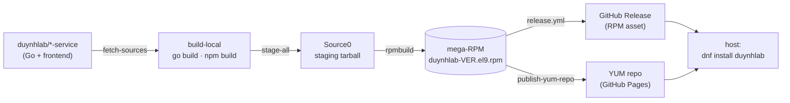

<div align="center">

# 📦 duynhlab/packages

**The distribution layer for the [duynhlab](https://github.com/duynhlab) e-commerce platform.**

Repacks the upstream Go binaries + frontend build into a single **mega-RPM** and ships it
through a YUM repository — so the whole platform installs with one `dnf install`.

[](https://github.com/duynhlab/packages/actions/workflows/build.yml)
[](https://github.com/duynhlab/packages/releases)


</div>

---

## What this is

This repo **does not contain service code** — that lives in the `duynhlab/<svc>-service` repos.
It is purely the **packaging + delivery** layer: it fetches the pre-built artifacts, assembles
them into a Filesystem-Hierarchy-Standard payload, and produces one versioned RPM that deploys
the platform as an atomic unit.



> **Release builds compose the backends from each service's published release
> binaries** (`source=release` → `fetch-releases.sh`, pinned in
> [`services.lock`](services.lock); checksum-verified) instead of compiling from
> source. The frontend is always built from source (it has no binary release).
> Local/CI builds default to compiling — see [`docs/004-build.md`](docs/004-build.md).

| | |
|---|---|
| **Format** | RPM — EL9 (Rocky · AlmaLinux · RHEL 9), `x86_64` |
| **Build tool** | `rpmbuild` against [`packages/rpm/duynhlab.spec`](packages/rpm/duynhlab.spec) — no nFPM, no Docker build image |
| **Output** | `duynhlab-<VERSION>-1.el9.x86_64.rpm` — 8 backends + frontend + CLI + config templates |
| **Source of truth** | the service registry hardcoded in [`scripts/lib/common.sh`](scripts/lib/common.sh) — every build script reads it |

## Services in the package

Nine services ship in one RPM. Ports come straight from the registry (defaults `8080`/`9090`
would collide on a shared host, so each gets its own).

| Service | HTTP | gRPC | Database |
|---|:---:|:---:|---|
| `auth` | 8001 | 9001 | `duynhlab_auth` |
| `user` | 8002 | — | `duynhlab_user` |
| `product` | 8003 | — | `duynhlab_product` |
| `cart` | 8004 | — | `duynhlab_cart` |
| `order` | 8005 | — | `duynhlab_order` |
| `review` | 8006 | 9006 | `duynhlab_review` |
| `notification` | 8007 | 9007 | `duynhlab_notification` |
| `shipping` | 8008 | 9008 | `duynhlab_shipping` |
| `frontend` | 8080 | — | _(static SPA)_ |

## Quick start

### 🚀 Install (end user)

```bash
sudo curl -fsSL -o /etc/yum.repos.d/duynhlab.repo \
  https://duynhlab.github.io/packages/duynhlab.repo
sudo dnf install -y duynhlab
sudo systemctl enable --now duynhlab-platform.target
```

The database **bootstraps itself** — a one-shot unit creates every per-service DB + roles and
runs migrations before the backends start. Prerequisites, remote-DB `bootstrap.env`, verify,
upgrade, and removal: **[`docs/002-install.md`](docs/002-install.md)**.

### 🔧 Build locally (maintainer)

```bash
make fetch-sources          # clone every service repo into ../
make build-local-all        # compile binaries + frontend dist
make build                  # stage Source0 tarball + rpmbuild -> dist/*.rpm
make test-install           # file-level install check in Rocky 9
```

`BUILD_RUNNER=host|docker` is auto-detected. Full pipeline, scripts, and Makefile
reference: **[`docs/004-build.md`](docs/004-build.md)**.

## CI / Release

> **Merging to `main` publishes nothing.** Releases are **tag-driven** — `make release` cuts the
> next free CalVer tag (`v2026.06.11`, second cut of the day → `v2026.06.11.1`).

- **[`build.yml`](.github/workflows/build.yml)** — _validates_ every PR and push to `main`
  (docs-only changes skipped): build + file-level install test in a Rocky 9 container. Never
  publishes.
- **[`release.yml`](.github/workflows/release.yml)** — fires on a CalVer tag: builds the RPM with
  the tag as its version, runs the install test on that exact RPM, uploads it to a GitHub Release
  (auto notes + a manifest of the 9 service commits), and refreshes the YUM metadata on Pages —
  indexing the **last 3 releases** so `dnf downgrade duynhlab` works.
- Both share one pipeline: **[`_build-test.yml`](.github/workflows/_build-test.yml)**.

Details + rationale: [`docs/004-build.md`](docs/004-build.md) § CI workflows.

## Documentation

Numbered in reading order — start at `001`.

| Doc | Contents |
|---|---|
| [`001-architecture.md`](docs/001-architecture.md) | What ships in the package, FHS layout, systemd model, lifecycle |
| [`002-install.md`](docs/002-install.md) | End-user install, bootstrap, upgrade, downgrade, remove, troubleshooting |
| [`003-operations.md`](docs/003-operations.md) | `duynhctl`, `duynhdb`, systemd targets, day-2 ops |
| [`004-build.md`](docs/004-build.md) | Build pipeline, scripts, Makefile, CI workflows, publishing |
| [`005-release.md`](docs/005-release.md) | Release runbook: cut, same-day hotfix, re-publish, rollback, audit |
| [`006-add-service.md`](docs/006-add-service.md) | Onboarding a new service: registry entry + touch-point checklist |
| [`007-file-reference.md`](docs/007-file-reference.md) | Every installed file (binaries, configs, units), who creates it, upgrade behavior |
| [`AGENTS.md`](AGENTS.md) | Repository layout, conventions, contributor/agent guide |
