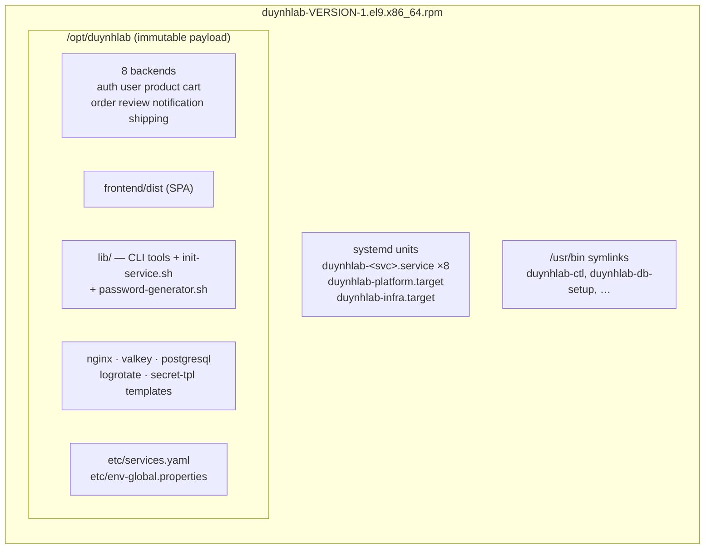
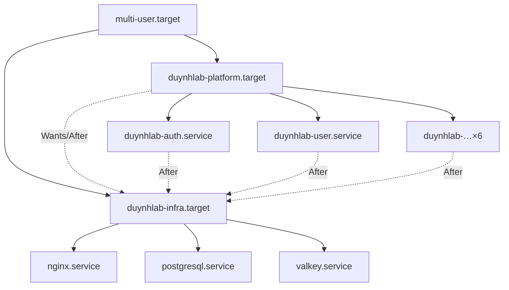
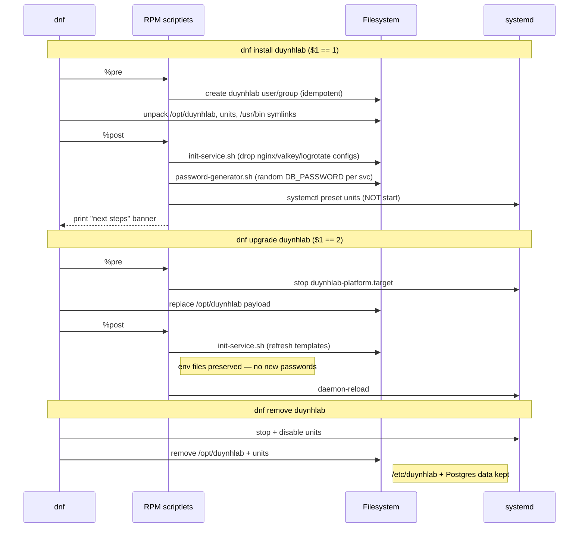
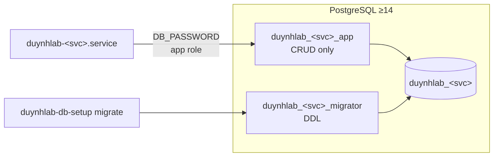

# Architecture

`duynhlab/packages` produces **one RPM** (a "mega-RPM") that contains the
entire duynhlab platform. This document describes what is inside the package,
where files land on disk, and the runtime lifecycle.

---

## 1. Why a single mega-RPM

The platform is built from many independent `duynhlab/*-service` repos, but it
is **deployed as a unit**. One package means:

- Atomic upgrades — all backends move together, no version skew between them.
- One dependency closure (`nginx`, `postgresql`, `valkey`/`redis`, `systemd`).
- One `dnf install duynhlab` for operators.
- A single SPEC ([`specs/duynhlab.spec`](../specs/duynhlab.spec)) instead of a
  per-service build matrix.

The trade-off (you cannot upgrade a single backend in isolation) is acceptable
because the services share a release train.

## 2. Components



| Component | Count | Notes |
|---|---|---|
| Backend services | 8 | Static Go binaries (`CGO_ENABLED=0`), one per `services.yaml` entry of `type: backend` |
| Frontend | 1 | `type: static`, npm build output served by nginx |
| CLI tools | 4 | `duynhlab-ctl`, `duynhlab-db-setup`, `duynhlab-gen-env`, `duynhlab-gen-password` |
| systemd units | 8 + 2 targets | per-service `.service` + `duynhlab-platform.target` + `duynhlab-infra.target` |

### Services (from `services.yaml`)

| Service | Port | DB | Extra `After=` |
|---|---|---|---|
| auth | 8001 | `duynhlab_auth` | — |
| user | 8002 | `duynhlab_user` | — |
| product | 8003 | `duynhlab_product` | — |
| cart | 8004 | `duynhlab_cart` | — |
| order | 8005 | `duynhlab_order` | — |
| review | 8006 | `duynhlab_review` | — |
| notification | 8007 | `duynhlab_notification` | — |
| shipping | 8008 | `duynhlab_shipping` | — |
| frontend | — | — | static, served by nginx |

> `services.yaml` is the single source of truth. Adding a service there +
> rebuilding regenerates units, the staging tree, and `duynhlab-ctl` output.

## 3. Filesystem layout (FHS)

```
/opt/duynhlab/                      Immutable payload (owned by package)
├── <svc>/
│   ├── bin/<svc>-service           Backend binary (migrations embedded via go:embed)
│   ├── BINARY_VERSION
│   └── SCHEMA_VERSION              Max embedded migration version (audit-only)
├── frontend/dist/                  Static SPA
├── lib/                            CLI tools + init-service.sh + password-generator.sh
├── nginx/ valkey/ postgresql/      Config templates (copied into /etc on install)
├── logrotate/ secret-tpl/
└── etc/
    ├── services.yaml               Runtime copy read by CLI tools
    ├── env-global.properties       Shared env (DB host, etc.)
    └── manifest                    Composition: the 9 service commits this
                                    build was made from (audit / release notes)

/etc/duynhlab/                      Mutable state (NOT overwritten on upgrade)
├── env-global.properties           Global overrides
├── <svc>.env                       Per-service env incl. random DB_PASSWORD (0640)
└── <svc>.override                  Optional operator override (EnvironmentFile=-)

/usr/lib/systemd/system/            Units
├── duynhlab-<svc>.service ×8
├── duynhlab-platform.target
└── duynhlab-infra.target

/usr/bin/duynhlab-*                 Symlinks into /opt/duynhlab/lib

/var/log/duynhlab/  /var/lib/duynhlab/    Log + state dirs
```

**Key principle**: `/opt/duynhlab` belongs to the package and is replaced on
every upgrade; `/etc/duynhlab` belongs to the operator and survives upgrades
and removal.

## 4. systemd model



- **`duynhlab-infra.target`** — pulls in the external infra (`nginx`,
  `postgresql`, `valkey`) via `Wants=`. Not owned/managed by us, just ordered.
- **`duynhlab-platform.target`** — the operator entry point. `enable --now`
  starts all backends.
- Each **`duynhlab-<svc>.service`** is `PartOf=duynhlab-platform.target`,
  ordered `After=duynhlab-infra.target`, runs as `duynhlab:duynhlab` with a
  hardened sandbox (`ProtectSystem=strict`, `NoNewPrivileges`,
  `MemoryDenyWriteExecute`, restricted syscalls/address families).

Each unit loads, in order:

```
EnvironmentFile=-/etc/duynhlab/env-global.properties   # optional shared
EnvironmentFile=/etc/duynhlab/<svc>.env                # required, has DB_PASSWORD
EnvironmentFile=-/etc/duynhlab/<svc>.override          # optional operator
```

## 5. Install / upgrade / remove lifecycle



What the scriptlets guarantee:

- **First install only** generates passwords; upgrades never touch
  `/etc/duynhlab/*.env`.
- **No auto-start** — installing does not enable or start any unit.
- **No auto-migrate** — the DB schema is the operator's responsibility via
  `duynhlab-db-setup migrate`.
- **No mutation of user-owned config** — nginx/valkey fragments are dropped
  under `conf.d/`, never overwriting `nginx.conf`/`valkey.conf`.

## 6. Database model

Each backend owns one database and two roles (least privilege):



- `bootstrap` (needs `SUPERUSER_DSN`) creates the database + both roles + grants.
- `migrate` execs the service binary's own `migrate` subcommand
  (`<binary> migrate`, golang-migrate embedded via `go:embed`) as the migrator
  role against the direct DB host. Forward-only; no separate migrate tool, no
  loose SQL.

See [operations.md](003-operations.md) for the commands.
