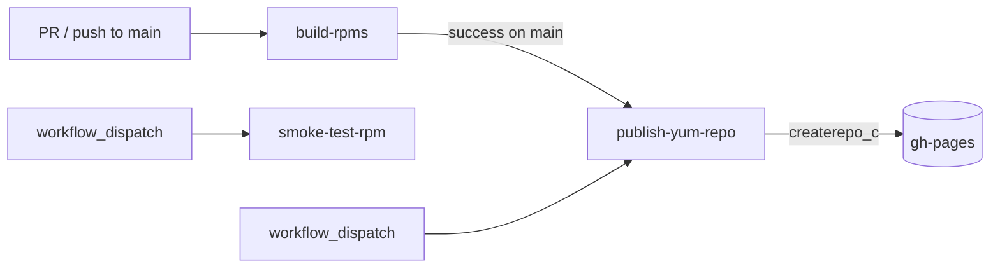

# Build & Release

How a commit becomes an installable RPM in the YUM repo. The whole pipeline is
driven by [`services.yaml`](../services.yaml) and produces a single
`duynhlab-<VERSION>-1.el9.x86_64.rpm`.

---

## 1. Pipeline overview


## 2. Scripts

All scripts live in [`scripts/`](../scripts) and source
[`scripts/lib/common.sh`](../scripts/lib/common.sh) for shared helpers
(`svc_field`, logging, `require_cmd`).

| Script | Input | Output | Purpose |
|---|---|---|---|
| `fetch-sources.sh [ref]` | `services.yaml` | `$DUYNHLAB_SRC_ROOT/<svc>` | `git clone`/`pull` every service repo at `ref` (default `main`) |
| `build-local.sh <svc> [ver]` | sibling checkout | `build/<svc>/raw/*.tar.gz` + `.sha256` | Compile one service (`CGO_ENABLED=0 GOOS=linux GOARCH=amd64`) or `npm build` for frontend; tar binary + migrations |
| `render-systemd.sh [outdir]` | `services.yaml` + tmpl | `build/systemd/` | Render per-service `.service` + `duynhlab-platform.target` |
| `stage-all.sh` | `build/*/raw/` + units | `build/sources/duynhlab-<ver>-staging.tar.gz` | Assemble the FHS payload tree → Source0 tarball |
| `build-rpm.sh` | Source0 + spec | `dist/*.rpm` | `rpmbuild -ba specs/duynhlab.spec` |
| `publish-yum-repo.sh` | `dist/*.rpm` | `build/gh-pages/` | `createrepo_c` + landing page + `duynhlab.repo` |
| `smoke-install.sh` | `dist/*.rpm` | — | File-level install check in Rocky 9 |
| `smoke-full.sh` | `dist/*.rpm` | — | Full systemd boot + health check (podman + Postgres) |

### Runner auto-detection

`build-rpm.sh` and `publish-yum-repo.sh` pick how to run `rpmbuild` /
`createrepo_c`:

```
BUILD_RUNNER      = host | podman | docker   (build-rpm.sh)
CREATEREPO_RUNNER = host | podman | docker   (publish-yum-repo.sh)
```

If unset, they prefer a host binary, then `podman`, then `docker`. Container
builds use `rockylinux:9` (override with `BUILD_IMAGE`).

## 3. Makefile

```bash
make help                     # list targets + show resolved env

make fetch-sources REF=main   # clone/update all service repos
make build-local SERVICE=auth # build a single service
make build-local-all          # build every service in services.yaml
make render-systemd           # render units only
make stage                    # build Source0 staging tarball
make build                    # stage + rpmbuild -> dist/
make smoke                    # file-level install check
make smoke-full               # full systemd smoke (podman + Postgres)
make publish-repo             # stage gh-pages YUM tree
make all                      # stage + build + smoke
make clean                    # rm build/ dist/
```

Environment knobs:

| Var | Default | Meaning |
|---|---|---|
| `VERSION` | `$(date -u +%Y.%m.%d)` | RPM version (CalVer) |
| `DUYNHLAB_SRC_ROOT` | `..` (sibling dir) | Where service repos are cloned |
| `BUILD_RUNNER` | auto | `host`/`podman`/`docker` for rpmbuild |
| `SKIP_MIGRATE_DOWNLOAD` | unset | Skip golang-migrate fetch during stage |

## 4. Local build walkthrough

```bash
# 0. (once) clone the service repos as siblings of this repo
make fetch-sources

# 1. compile binaries + frontend dist
make build-local-all

# 2. produce the RPM
make build
ls -lh dist/                 # duynhlab-2026.06.01-1.el9.x86_64.rpm

# 3. verify it installs cleanly
make smoke

# 4. (optional) full boot test with a real Postgres + systemd
make smoke-full              # needs podman with cgroup v2

# 5. (optional) stage a local YUM mirror
REPO_OUT=/tmp/duynhlab-repo BASE_URL=http://localhost:8080 \
  ./scripts/publish-yum-repo.sh
python3 -m http.server -d /tmp/duynhlab-repo 8080
```

## 5. CI workflows



| Workflow | File | Trigger | Does |
|---|---|---|---|
| **build-rpms** | [`build.yml`](../.github/workflows/build.yml) | PR + push to `main`, manual | fetch → build-local → render-systemd → **stage-all** → build-rpm → smoke-install → upload artefact |
| **publish-yum-repo** | [`publish-yum-repo.yml`](../.github/workflows/publish-yum-repo.yml) | `workflow_run` after build-rpms on `main`, manual | rebuild RPM → `createrepo_c` → commit/push `gh-pages` |
| **smoke-test-rpm** | [`smoke-test-rpm.yml`](../.github/workflows/smoke-test-rpm.yml) | manual, `workflow_call` | full systemd smoke in podman |

> **Critical ordering**: `stage-all.sh` must run before `build-rpm.sh` — the
> spec's `Source0` is the staging tarball. Every build workflow includes that
> step.

### Why gh-pages branch-push (not `deploy-pages` action)

The YUM repo is an **append-only artefact store** that grows ~per release.
`actions/upload-pages-artifact` caps at 1 GB and replaces the whole site each
deploy, which breaks `createrepo_c --update` (it needs the previous repodata on
disk). Branch-push keeps the repodata, gives a git audit trail, and can be
force-reset to prune. If the tree ever exceeds ~1 GB, migrate to S3/R2 rather
than the Pages artefact flow.

## 6. Versioning

- **Scheme**: CalVer `YYYY.MM.DD` (set `VERSION=` to override).
- **Release tag**: `Release: 1%{?dist}` → `…-1.el9`.
- `createrepo_c` dedupes by NVRA; rebuilding the same version overwrites
  identical bits.

## 7. Adding a new service

1. Add an entry to [`services.yaml`](../services.yaml) (name, repo, port, type,
   and `database` if it needs one).
2. `make fetch-sources build-local-all build` — units, staging tree, and
   `duynhlab-ctl` pick it up automatically.
3. Update the hard-coded service loop in
   [`specs/duynhlab.spec`](../specs/duynhlab.spec) `%check`/`%post` if the new
   service is a backend (the spec lists the eight backends explicitly).
