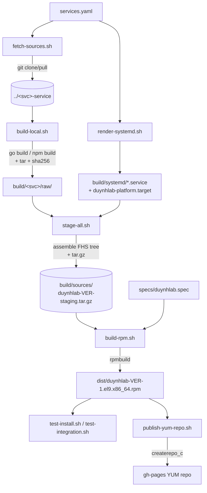
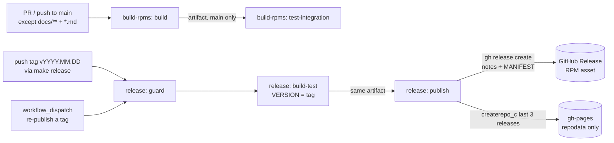

# Build & Release

How a commit becomes an installable RPM in the YUM repo. The whole pipeline is
driven by [`services.yaml`](../services.yaml) and produces a single
`duynhlab-<VERSION>-1.el9.x86_64.rpm`.

---

## 1. Pipeline overview



## 2. Scripts

All scripts live in [`scripts/`](../scripts) and source
[`scripts/lib/common.sh`](../scripts/lib/common.sh) for shared helpers
(`svc_field`, logging, `require_cmd`).

| Script | Input | Output | Purpose |
|---|---|---|---|
| `fetch-sources.sh [ref]` | `services.yaml` | `$DUYNHLAB_SRC_ROOT/<svc>` | `git clone`/`pull` every service repo at `ref` (default `main`) |
| `build-local.sh <svc> [ver]` | sibling checkout | `build/<svc>/raw/*.tar.gz` + `.sha256` | Compile one service (`CGO_ENABLED=0 GOOS=linux GOARCH=amd64`) or `npm build` for frontend; tar binary + migrations |
| `render-systemd.sh [outdir]` | `services.yaml` + tmpl | `build/systemd/` | Render per-service `.service` + `duynhlab-platform.target` |
| `stage-all.sh` | `build/*/raw/` + units | `build/sources/duynhlab-<ver>-staging.tar.gz` | Assemble the FHS payload tree + generate the composition manifest (`etc/manifest`) → Source0 tarball |
| `build-rpm.sh` | Source0 + spec | `dist/*.rpm` | `rpmbuild -ba specs/duynhlab.spec` |
| `publish-yum-repo.sh` | `dist/*.x86_64.rpm` | `build/gh-pages/` | `createrepo_c` + landing page + `duynhlab.repo` |

> **Why no SRPMs are published**: `rpmbuild -ba` also emits a source RPM
> (`dist/*.src.rpm`), but `publish-yum-repo.sh` only publishes the binary
> `*.x86_64.rpm`. An SRPM is the *source bundle* (code + spec + patches) used to
> `rpmbuild --rebuild` a binary — it is **not** installable and `dnf install`
> never needs it. Reasons it is dropped:
>
> - **Not needed**: this is a binary-only YUM repo; clients only consume the
>   `.x86_64.rpm`.
> - **Redundant**: the real source lives in the upstream
>   `duynhlab/<svc>-service` repos; the SRPM is just a fat copy of all eight
>   services + frontend (~86 MB).
> - **Breaks publishing**: at ~103 MB it exceeds GitHub's hard **100 MB
>   per-file** limit, so pushing it to `gh-pages` is rejected
>   (`pre-receive hook declined`).
>
> Keep SRPMs only if you ever distribute via Fedora/EPEL or must ship source for
> compliance — neither applies here.
| `test-install.sh` | `dist/*.rpm` | — | File-level install check in Rocky 9 |
| `test-integration.sh` | `dist/*.rpm` | — | Full systemd boot + health check (podman + Postgres) |

### Runner auto-detection

`build-rpm.sh` and `publish-yum-repo.sh` pick how to run `rpmbuild` /
`createrepo_c`:

```
BUILD_RUNNER      = host | podman | docker   (build-rpm.sh)
CREATEREPO_RUNNER = host | podman | docker   (publish-yum-repo.sh)
```

If unset, they prefer a host binary, then `podman`, then `docker`. Container
builds use `rockylinux:9` (override with `BUILD_IMAGE`).

## 3. Makefile

```bash
make help                     # list targets + show resolved env

make fetch-sources REF=main   # clone/update all service repos
make build-local SERVICE=auth # build a single service
make build-local-all          # build every service in services.yaml
make render-systemd           # render units only
make stage                    # build Source0 staging tarball
make build                    # stage + rpmbuild -> dist/
make test-install             # file-level install check
make test-integration         # full systemd boot + health (podman + Postgres)
make publish-repo             # stage gh-pages YUM tree
make release                  # cut a release: next CalVer tag -> push -> release.yml
make all                      # stage + build + test-install
make clean                    # rm build/ dist/
```

Environment knobs:

| Var | Default | Meaning |
|---|---|---|
| `VERSION` | `$(date -u +%Y.%m.%d)` | RPM version (CalVer) |
| `DUYNHLAB_SRC_ROOT` | `..` (sibling dir) | Where service repos are cloned |
| `BUILD_RUNNER` | auto | `host`/`podman`/`docker` for rpmbuild |

## 4. Local build walkthrough

```bash
# 0. (once) clone the service repos as siblings of this repo
make fetch-sources

# 1. compile binaries + frontend dist
make build-local-all

# 2. produce the RPM
make build
ls -lh dist/                 # duynhlab-2026.06.01-1.el9.x86_64.rpm

# 3. verify it installs cleanly
make test-install

# 4. (optional) full boot test with a real Postgres + systemd
make test-integration        # needs podman with cgroup v2

# 5. (optional) stage a local YUM mirror
REPO_OUT=/tmp/duynhlab-repo BASE_URL=http://localhost:8080 \
  ./scripts/publish-yum-repo.sh
python3 -m http.server -d /tmp/duynhlab-repo 8080
```

## 5. CI workflows



| Workflow | File | Trigger | Does |
|---|---|---|---|
| **build-rpms** | [`build.yml`](../.github/workflows/build.yml) | PR + push to `main` (ignores `docs/**` + `**.md`), manual | **Validate only — never publishes.** Job `build`: fetch → build-local → render-systemd → **stage-all** → build-rpm → test-install → upload artefact (CI-only, 14d). Job `test-integration` (main + manual, `needs: build`): full systemd + Postgres integration test on the artifact. |
| **release** | [`release.yml`](../.github/workflows/release.yml) | push tag `v*` (cut via `make release`), or `workflow_dispatch` to re-publish an existing tag | `guard`: tag is CalVer `vYYYY.MM.DD[.N]`, SHA is on `main`, release doesn't already exist. `build-test`: same pipeline with **`VERSION = tag`**, then test-install + test-integration on that exact RPM. `publish`: GitHub Release (auto-generated notes + **composition manifest** of the 9 service SHAs, `MANIFEST.txt` asset) → multi-version repodata (**current + 2 previous releases** → `dnf downgrade` works) → orphan `gh-pages` push → `deploy-pages`. Published RPM == tested RPM (same artifact, same run). |

**Cutting a release:**

```bash
git checkout main && git pull
make release        # computes next free tag (v2026.06.11 → v2026.06.11.1 …),
                    # creates an ANNOTATED tag, pushes it; release.yml does the rest
```

Full operational runbook (same-day hotfix, re-publishing a tag, rollback,
auditing a release's composition): [`release.md`](release.md).

> **Critical ordering**: `stage-all.sh` must run before `build-rpm.sh` — the
> spec's `Source0` is the staging tarball. Every build workflow includes that
> step.

### Where the RPMs live: GitHub Releases, not gh-pages

The mega-RPM is ~70–80 MB and grows per release. Committing it to a git branch
is a dead end: GitHub hard-rejects any file >100 MB (`pre-receive hook
declined`) and accumulating 80 MB blobs across releases bloats history until the
repo hits its size cap.

So the RPM payload is hosted as a **GitHub Release asset** (2 GB per-file
limit), and `gh-pages` carries **only the YUM metadata**:

```
GitHub Release  v<VER>/duynhlab-<VER>-1.el9.x86_64.rpm     (the actual package)
gh-pages        rpm/el9/x86_64/repodata/*                  (KB of metadata)
                duynhlab.repo, index.html, README.md
```

`createrepo_c --location-prefix
https://github.com/duynhlab/packages/releases/download/v<VER>/` writes the
metadata's `<location href>` as an **absolute URL** to the release asset, so
`dnf` reads metadata from Pages and downloads the RPM straight from Releases.

Because gh-pages is now KB-sized, it is force-pushed as a **single-commit orphan
branch** each run — no large-file pushes, no history bloat. Release history (and
rollback) is preserved on the Releases page itself, keyed by the `v<VER>` tag.

`actions/deploy-pages` then publishes the gh-pages tree (it replaces the whole
site each deploy, which is fine because the metadata is fully regenerated every
run). Local `make publish-repo` runs without `RELEASE_BASE_URL`, falling back to
the self-contained model (RPMs copied into the tree) so the repo is servable
from `python3 -m http.server`.

## 6. Versioning

- **Scheme**: CalVer `YYYY.MM.DD` (set `VERSION=` to override).
- **Release tag**: `Release: 1%{?dist}` → `…-1.el9`.
- `createrepo_c` dedupes by NVRA; rebuilding the same version overwrites
  identical bits.

## 7. Adding a new service

1. Add an entry to [`services.yaml`](../services.yaml) (name, repo, port, type,
   and `database` if it needs one).
2. `make fetch-sources build-local-all build` — units, staging tree, and
   `duynhlab-ctl` pick it up automatically.
3. Update the hard-coded service loop in
   [`specs/duynhlab.spec`](../specs/duynhlab.spec) `%check`/`%post` if the new
   service is a backend (the spec lists the eight backends explicitly).
