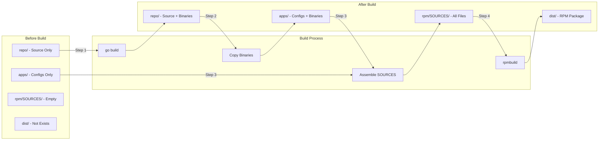
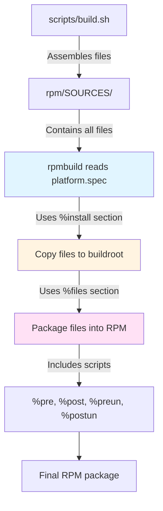

# Directory Structure

This document describes the directory structure of the Platform RPM Builder project, showing what exists before and after the build process.

## Directory Structure (Before Build)

This is the structure of the repository as it exists in source control, before running any build commands.

```
rpm-builder/
├── repo/                    # Source code (Go services)
│   ├── api-server/          # API server source code
│   │   ├── main.go
│   │   ├── config/
│   │   ├── handlers/
│   │   └── go.mod
│   ├── user-api/            # User API source code
│   │   ├── main.go
│   │   ├── config/
│   │   ├── handlers/
│   │   └── go.mod
│   ├── checkout-api/        # Checkout API source code
│   │   ├── main.go
│   │   ├── config/
│   │   ├── handlers/
│   │   └── go.mod
│   ├── voter-api/           # Voter API source code
│   │   ├── main.go
│   │   ├── config/
│   │   ├── handlers/
│   │   └── go.mod
│   └── README.md
│
├── apps/                    # Configuration files (committed)
│   ├── conf/                # Shared configuration files
│   │   ├── env.properties
│   │   └── redis.properties
│   ├── api-server/
│   │   └── api-server.properties
│   ├── user-api/
│   │   └── user-api.properties
│   ├── checkout-api/
│   │   └── checkout-api.properties
│   └── voter-api/
│       └── voter-api.properties
│
├── infra/                  # Infrastructure configurations
│   ├── nginx/
│   │   └── platform.conf
│   └── redis/
│       └── platform-redis.conf
│
├── rpm/
│   ├── specs/
│   │   └── platform.spec    # RPM specification file
│   ├── files/
│   │   └── systemd/         # Systemd service files
│   │       ├── platform-api-server.service
│   │       ├── platform-user-api.service
│   │       ├── platform-checkout-api.service
│   │       ├── platform-voter-api.service
│   │       ├── platform-infra.target
│   │       └── platform-all.target
│   ├── platform/
│   │   └── lib/             # Initialization scripts
│   │       ├── print-version.sh
│   │       └── README.md
│   └── SOURCES/             # Empty (generated during build)
│
├── scripts/
│   └── build.sh             # Main build script
│
├── docs/                    # Documentation
│   ├── getting-started.md
│   ├── build-process.md
│   ├── directory-structure.md
│   └── README.md
│
├── Dockerfile               # Docker image for RPM builds
├── Makefile                # Build automation
├── README.md               # Project overview
└── .gitignore
```

**Key Points:**
- `repo/` contains only source code (no binaries)
- `apps/` contains only configuration files (no binaries)
- `rpm/SOURCES/` is empty or doesn't exist
- `dist/` doesn't exist
- No build artifacts present

## Directory Structure (After Build)

This is the structure after running `make build`, showing generated files and build artifacts.

```
rpm-builder/
├── repo/                    # Source code + binaries (generated)
│   ├── api-server/
│   │   ├── main.go          # (source)
│   │   ├── api-server       # (generated binary)
│   │   ├── config/
│   │   ├── handlers/
│   │   └── go.mod
│   ├── user-api/
│   │   ├── main.go          # (source)
│   │   ├── user-api         # (generated binary)
│   │   └── ...
│   └── ...
│
├── apps/                    # Staging area (binaries copied here)
│   ├── conf/                # (unchanged)
│   ├── api-server/
│   │   ├── api-server       # (binary copied from repo/)
│   │   └── api-server.properties
│   ├── user-api/
│   │   ├── user-api         # (binary copied from repo/)
│   │   └── user-api.properties
│   └── ...
│
├── rpm/
│   ├── specs/
│   │   └── platform.spec    # (unchanged)
│   ├── files/
│   │   └── systemd/         # (unchanged)
│   ├── platform/
│   │   └── lib/             # (unchanged)
│   └── SOURCES/             # Generated during build
│       ├── api-server/
│       │   └── api-server
│       ├── user-api/
│       │   ├── user-api
│       │   └── user-api.properties
│       ├── checkout-api/
│       │   ├── checkout-api
│       │   └── checkout-api.properties
│       ├── voter-api/
│       │   ├── voter-api
│       │   └── voter-api.properties
│       ├── conf/
│       │   ├── env.properties
│       │   └── redis.properties
│       ├── platform.conf
│       ├── platform-redis.conf
│       ├── platform-*.service
│       ├── platform-*.target
│       └── print-version.sh
│   ├── BUILD/               # Generated by rpmbuild
│   ├── BUILDROOT/            # Generated by rpmbuild
│   ├── RPMS/                # Generated by rpmbuild
│   │   └── x86_64/
│   │       └── platform-1.0.0-1.x86_64.rpm
│   └── SRPMS/               # Generated by rpmbuild
│
└── dist/                    # Final output (generated)
    └── platform-1.0.0-1.x86_64.rpm
```

**Key Points:**
- `repo/` now contains binaries (generated by `go build`)
- `apps/` now contains binaries (copied from `repo/`)
- `rpm/SOURCES/` contains all files needed for RPM build
- `rpm/BUILD*`, `rpm/RPMS*`, etc. are temporary build directories
- `dist/` contains the final RPM package

## Build Transformation Flow



## File Types: Committed vs Generated

### Committed to Git (Source Files)

- All files in `repo/` (source code only, before build)
- All files in `apps/` (configuration files only)
- All files in `infra/`
- All files in `rpm/specs/`
- All files in `rpm/files/`
- All files in `rpm/platform/lib/`
- `scripts/build.sh`
- `Dockerfile`, `Makefile`
- Documentation files

### Generated During Build (Not Committed)

- Binaries in `repo/{service}/{service}` (after `go build`)
- Binaries in `apps/{service}/{service}` (copied from repo)
- Everything in `rpm/SOURCES/`
- Everything in `rpm/BUILD*`, `rpm/BUILDROOT*`, `rpm/RPMS*`, `rpm/SRPMS*`
- Everything in `dist/`

### Clean Build Artifacts

To remove all generated files:

```bash
make clean
```

This removes:
- All binaries from `repo/` and `apps/`
- `rpm/SOURCES/` contents
- `rpm/BUILD*`, `rpm/BUILDROOT*`, `rpm/RPMS*`, `rpm/SRPMS*`
- `dist/` directory

## Directory Purposes

| Directory | Purpose | Committed? | Generated? |
|-----------|---------|------------|------------|
| `repo/` | Source code for Go services | Yes (source) | Yes (binaries) |
| `apps/` | Configuration files and staging area | Yes (configs) | Yes (binaries) |
| `infra/` | Infrastructure configurations | Yes | No |
| `rpm/specs/` | RPM specification files | Yes | No |
| `rpm/files/` | Systemd service files | Yes | No |
| `rpm/platform/lib/` | Initialization scripts | Yes | No |
| `rpm/SOURCES/` | Files assembled for RPM build | No | Yes |
| `rpm/BUILD*` | Temporary build directories | No | Yes |
| `dist/` | Final RPM package output | No | Yes |
| `scripts/` | Build scripts | Yes | No |
| `docs/` | Documentation | Yes | No |

## Understanding platform.spec

The `rpm/specs/platform.spec` file is the **core RPM specification file** that defines how the RPM package is built, what files it contains, and how it installs on the target system.

### What is a Spec File?

A `.spec` file is a blueprint for building an RPM package. It tells `rpmbuild`:
- Package metadata (name, version, description)
- Build requirements (Go 1.25, dependencies)
- What files to include in the package
- Where to install files on the target system
- What scripts to run during installation/removal

### Key Sections in platform.spec

#### 1. Package Metadata
```spec
Name:           platform
Version:        1.0.0
Release:        1
Summary:        Platform - All Services
BuildRequires:  golang >= 1.25
Requires:       nginx >= 1.20, redis >= 6.0, systemd
```
- **Name**: Package name (used in `rpm -qa | grep platform`)
- **Version**: Software version
- **Release**: Package release number (incremented for rebuilds)
- **BuildRequires**: Tools needed to build the package
- **Requires**: Runtime dependencies (installed automatically)

#### 2. %description
Describes what the package provides - services, ports, features.

#### 3. %prep
Preparation phase. In this project, it's empty because we use pre-built binaries.

#### 4. %build
Build phase. Empty here because binaries are built by `scripts/build.sh` before RPM creation.

#### 5. %install
**Most important section** - Defines what gets installed and where:

```spec
%install
# Create directory structure
mkdir -p %{buildroot}/opt/platform/apps/conf/
mkdir -p %{buildroot}/opt/platform/apps/api-server/
# ... more directories

# Copy files from SOURCES to buildroot
cp %{_sourcedir}/api-server/api-server %{buildroot}/opt/platform/apps/api-server/
cp %{_sourcedir}/conf/*.properties %{buildroot}/opt/platform/apps/conf/
# ... more copies

# Copy initialization scripts
cp %{_sourcedir}/print-version.sh %{buildroot}/opt/platform/lib/
chmod +x %{buildroot}/opt/platform/lib/print-version.sh
```

**Key concepts:**
- `%{buildroot}`: Temporary directory where files are staged before packaging
- `%{_sourcedir}`: Points to `rpm/SOURCES/` (where all files are assembled)
- Files copied here become part of the RPM package

#### 6. %files
**Critical section** - Lists all files that should be included in the RPM:

```spec
%files
/opt/platform/apps/api-server/api-server
/opt/platform/apps/user-api/user-api
%config(noreplace) /opt/platform/apps/conf/*.properties
/usr/lib/systemd/system/platform-*.service
/opt/platform/lib/print-version.sh
```

**Important flags:**
- `%config(noreplace)`: Configuration files - won't overwrite user modifications on upgrade
- No flag: Regular files - replaced on upgrade

#### 7. %pre
Scripts run **before** installation:
- Check port availability
- Create log directories
- Stop existing services (if upgrading)

#### 8. %post
Scripts run **after** installation:
- Set executable permissions
- Run initialization scripts (`print-version.sh`)
- Enable and start systemd services
- Configure Redis/nginx

#### 9. %preun
Scripts run **before** removal:
- Stop services
- Clean up temporary files

#### 10. %postun
Scripts run **after** removal:
- Reload systemd
- Final cleanup

### How platform.spec Works in the Build Process



### File Path Resolution

**During Build:**
- `%{_sourcedir}` = `rpm/SOURCES/` (where `build.sh` copies all files)
- Files in `rpm/SOURCES/` are referenced in `%install` section
- Files copied to `%{buildroot}` become part of the package

**After Installation:**
- Files from `%{buildroot}/opt/platform/` → `/opt/platform/` on target system
- Files from `%{buildroot}/etc/` → `/etc/` on target system
- Files from `%{buildroot}/usr/lib/systemd/` → `/usr/lib/systemd/` on target system

### Example: Adding a New Service

When adding a new service, you must update `platform.spec`:

**1. Add to %install section:**
```spec
# Create directory
mkdir -p %{buildroot}/opt/platform/apps/payment-api/

# Copy binary (from rpm/SOURCES/payment-api/payment-api)
cp %{_sourcedir}/payment-api/payment-api %{buildroot}/opt/platform/apps/payment-api/

# Copy config (from rpm/SOURCES/payment-api/payment-api.properties)
cp %{_sourcedir}/payment-api/payment-api.properties %{buildroot}/opt/platform/apps/payment-api/
```

**2. Add to %files section:**
```spec
# Binary
/opt/platform/apps/payment-api/payment-api

# Config (marked as noreplace to preserve user changes)
%config(noreplace) /opt/platform/apps/payment-api/payment-api.properties
```

**3. Add to %pre section (log directory):**
```spec
mkdir -p /var/log/platform/payment-api
```

**4. Add to %post section (executable permissions):**
```spec
chmod +x /opt/platform/apps/payment-api/payment-api
```

### Why platform.spec is Important

1. **Single Source of Truth**: Defines exactly what goes into the RPM
2. **Installation Behavior**: Controls how files are installed and configured
3. **Dependency Management**: Declares what the package needs (nginx, redis)
4. **Service Management**: Handles systemd service setup and startup
5. **Upgrade Safety**: `%config(noreplace)` protects user modifications
6. **Initialization**: Runs scripts to set up the environment

### Common Spec File Patterns Used

- **Wildcards**: `platform-*.service` matches all service files
- **Directory Creation**: `mkdir -p` ensures directories exist
- **Permissions**: `chmod +x` makes scripts executable
- **Conditional Logic**: `if [ $1 -gt 1 ]` detects upgrade vs install
- **Error Handling**: `|| true` prevents script failures from breaking install

### Relationship to Build Script

The `scripts/build.sh` script prepares files for `platform.spec`:

1. **build.sh** assembles all files into `rpm/SOURCES/`
2. **platform.spec** reads from `rpm/SOURCES/` (via `%{_sourcedir}`)
3. **platform.spec** installs files to `%{buildroot}` (temporary staging)
4. **rpmbuild** packages `%{buildroot}` contents into RPM
5. **RPM** installs to actual system paths

**Key Point**: `build.sh` prepares the files, `platform.spec` defines how they're packaged and installed.

