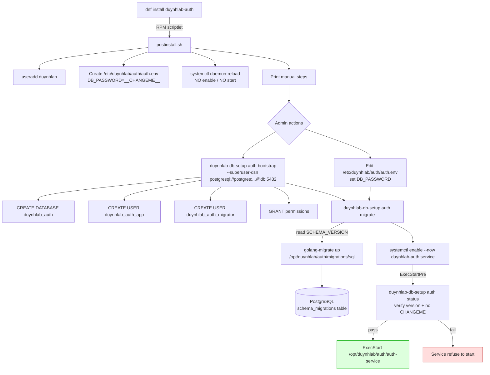
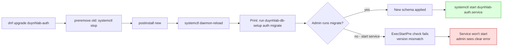
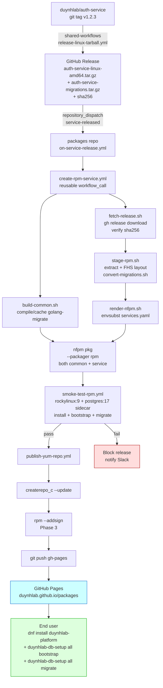
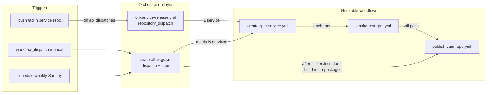
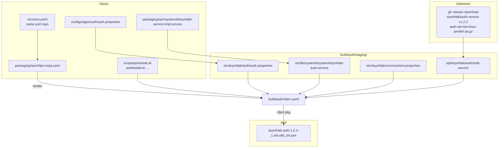
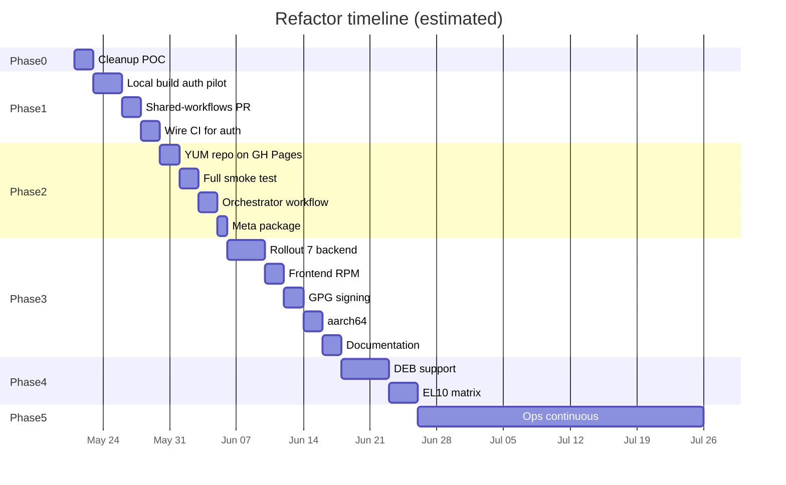

# Packages Repo — Refactor Plan

> Tracking document cho việc refactor `duynhlab/packages` từ POC sang distribution layer chuẩn (theo mô hình `ton-blockchain/packages`).
> Mark `[x]` khi xong từng task. Cập nhật mỗi PR.

**Mục tiêu cuối**: Người dùng cài bằng `dnf install duynhlab-<service>` từ YUM repo public, mỗi service repo tự release Linux tarball, packages repo chỉ repack RPM.

**Phạm vi version 1**: RPM only. EL9 (Rocky/AlmaLinux 9). amd64 only. 8 backend service + 1 frontend. Bỏ `pkg` (library, không cần đóng gói).

**Tham chiếu**:
- Phân tích nguồn cảm hứng: `/home/duydo/Working/Opswat/Docs/ton-blockchain-packages-analysis.md`
- Danh sách service: `duynhlab/homelab/SERVICES.md`
- Repo hiện tại: `duynhlab/packages`

---

## 0. Decisions đã chốt (lock — không tranh luận lại trừ khi có lý do mới)

| # | Quyết định | Trade-off đã cân nhắc | Lý do chọn |
|---|---|---|---|
| D1 | **Per-service RPM** + 1 meta-package `duynhlab-platform` | Monolithic 1 RPM gộp → đơn giản hơn, ít file hơn | Polyrepo 9 service version độc lập. Hotfix 1 service không nên rebuild 8 gói khác. Map đúng release cadence của từng repo. |
| D2 | **Repack binary từ GitHub Release của upstream**, không compile lại trong packages repo | Build từ source (`go install`) → packages repo self-contained | (a) Đảm bảo binary RPM = binary Docker image production = reproducibility. (b) Tách trách nhiệm sạch. (c) Theo TON pattern. |
| D3 | **nFPM** làm packaging tool, KHÔNG quay lại `rpmbuild` | rpmbuild → control granular hơn, %scripts macros phong phú hơn | Đã chứng minh chạy được. Multi-format ready (DEB sau). Spec ngắn hơn. Không cần Docker container build environment. |
| D4 | **YUM repo qua GitHub Pages** | Self-hosted S3/CDN → kiểm soát hoàn toàn, có thể serve apt repo cùng chỗ | Free, không hạ tầng riêng cần duy trì. TON đã chứng minh production-ready ở scale này. Lên S3 khi nào trên 5GB hoặc cần CDN. |
| D5 | **RPM only ở v1**, DEB ở Phase 4 | Làm RPM + DEB song song từ đầu → tiết kiệm round-trip | YAGNI. Validate end-to-end flow trước. nFPM đã abstract format nên thêm DEB sau là PR nhỏ. Giữ code path normalize RPM/DEB trong install scripts để dễ mở rộng. |
| D6 | **Bỏ `sources/` hoàn toàn** | Giữ làm "fallback build" nếu service repo chưa release | Tạo lẫn lộn 2 đường build. POC này có bug runtime (`apps/common` vs `apps/conf`). Đã có git history để restore. |
| D7 | **Bỏ `pkg` repo** khỏi scope | Đóng gói luôn cho user system-level Go dev | `pkg` là Go library, dùng qua `go.mod require`. Không có binary để ship. |
| D8 | **Service user `duynhlab:duynhlab`** thay vì `nobody:nobody` | `nobody` → không phải tạo user, ít script | Best practice security; có UID/GID riêng để audit. `nobody` chia sẻ với system process khác là anti-pattern. |
| D9 | **Layout FHS**: `/opt/duynhlab/<svc>/` binary, `/etc/duynhlab/<svc>/` config | Giữ `/opt/duynhlab/apps/<svc>/...` như hiện tại | Config ở `/etc/` là chuẩn FHS, sysadmin quen, tránh được bug path mismatch hiện tại. |
| D10 | **Per-service systemd unit** `duynhlab-<svc>.service` (1 file riêng cho mỗi service). KHÔNG dùng template `@.service`. | Template unit `duynhlab-service@.service` 1 file dùng chung → DRY hơn | Mỗi service có nhu cầu riêng: `auth` cần `After=postgres.service`, `notification` cần `After=redis.service`, `frontend` không cần DB. Override per-service qua template `systemctl edit` không trực quan bằng đọc file unit độc lập. Debug/audit dễ hơn (admin `cat /usr/lib/systemd/system/duynhlab-auth.service` thấy hết). Render từ template tại build time (xem 1.5). |
| D11 | **Log đi journald** thay vì file `/var/log/...` | File log → grep dễ, không cần journalctl | Loki/Promtail/Vector đều đọc journald native. Bớt 1 thư mục phải tạo/quản permission. User vẫn có thể `journalctl -u duynhlab-auth -f` hoặc `duynhlab-ctl logs auth -f`. |
| D12 | **`services.yaml`** làm single source of truth | Hardcode trong Makefile/workflow matrix | Thêm service mới = sửa 1 chỗ. Scripts + workflows + nfpm template đều render từ file này. |
| D13 | **Trigger build**: `repository_dispatch` từ service repo + `workflow_dispatch` thủ công | Cron poll release → đơn giản, không cần modify service repo | Dispatch event push-based, không lag, không lãng phí CI. Vẫn giữ dispatch tay để rebuild khi cần. |
| D14 | **YUM repo trên branch `gh-pages`** (không phải `main`) | Commit trên `main` như TON → 1 branch, dễ thấy lịch sử | `main` sẽ phình to vì mỗi release thêm `.rpm` ~10-50MB. `gh-pages` tách biệt, có thể `git push --force` reset history khi cần. |
| D15 | **Frontend đóng gói chung kiểu** với backend (RPM riêng) | Tách hẳn cơ chế cho static asset | Consistency. Frontend RPM ship `dist/` vào `/var/www/duynhlab-frontend/`, nginx conf trong cùng RPM. Vẫn fit template được. |
| D16 | **Mỗi service có DB PostgreSQL riêng** (`duynhlab_auth`, `duynhlab_product`, ...), ship migration `.sql` trong RPM tại `/opt/duynhlab/<svc>/migrations/sql/` | Share 1 database multi-schema → ít connection overhead, dễ join | Map đúng pattern k8s production (Zalando Operator 1 cluster / service). Isolation rõ ràng. Khi tách compute sau này dễ. RPM dùng cùng schema migrations file với k8s init container — single source of truth. |
| D17 | **KHÔNG bundle PostgreSQL server** trong RPM. Chỉ `Requires: postgresql >= 14` (client tools). User cài Postgres riêng. | Bundle postgres-server làm dependency → out-of-box experience tốt hơn | Postgres thường deploy chỗ riêng (managed RDS, dedicated VM, HA cluster). Force server dependency = bắt user cài Postgres trên app server. `duynhlab-platform-aio` meta-package optional ở Phase 4 cho ai muốn all-in-one. |
| D18 | **Migration tool**: ship binary helper `duynhlab-db-migrate` (Go, dùng `golang-migrate/migrate` lib) trong mỗi service RPM. KHÔNG dùng Flyway/JRE. | (a) Ship Flyway native (~150MB tar có JRE) → consistent với k8s. (b) Dùng `psql -f` + bash version tracking → zero new binary. | (a) Quá nặng cho RPM. (b) Fragile, không có rollback, không locking concurrent. `golang-migrate` là 1 binary ~10MB, dùng table `schema_migrations` chuẩn, hỗ trợ dirty state. Build-time convert filename `V1__init.sql` → `000001_init.up.sql`. |
| D19 | **Migration KHÔNG auto-chạy trong postinstall**. Admin gọi thủ công `duynhlab-db-setup <svc>` sau cài. | Auto-run khi `dnf install`/`update` → giống k8s init container, zero-touch | Postinstall không nên mutate external state (DB không phải file thuộc RPM). Bug migration → block toàn bộ dnf transaction. Admin có thể chạy migration với credential khác (DB user `migrator` vs `app`). Best practice của Debian/RPM (Postgres official spec cũng làm vậy). |
| D20 | **Credentials DB** đọc từ `/etc/duynhlab/<svc>/<svc>.env` (mode 0640, owner `root:duynhlab`). KHÔNG ship password mặc định. | Hardcode trong properties file mặc định → user "quên" đổi → security risk | Postinstall tạo file template với placeholder `DB_PASSWORD=__CHANGEME__`, refuse start systemd unit nếu phát hiện placeholder (config validation trong service). Tương tự pattern postgresql-server RPM. |
| D21 | **Mỗi RPM tự sinh password riêng tại postinstall** (random 32-char alphanumeric) thay vì placeholder `__CHANGEME__`. Script `duynhlab-gen-password` ship trong `duynhlab-common`. | Ship `__CHANGEME__` placeholder (D20 cũ) → bắt admin sửa tay, dễ quên | Postinstall lần đầu: nếu env file chưa tồn tại → gen password random, ghi vào `/etc/duynhlab/<svc>/<svc>.env` (mode 0640, `root:duynhlab`), print ra stdout cho admin copy. Lần cài lại: detect file tồn tại → KHÔNG ghi đè. Tool `duynhlab-gen-password [length]` callable thủ công (admin rotate). DB user/db name vẫn deterministic theo D16 (`duynhlab_<svc>_app`). Refine D20: chỉ refuse start nếu env file thiếu hoặc password rỗng — placeholder pattern không còn cần thiết. |
| D22 | **Build local-first cho từng service code repo trước khi điều chỉnh GH Actions**. Workflow: checkout `main` của mỗi service repo → build binary local (`go build`) → tar `<svc>-linux-amd64.tar.gz` + `<svc>-migrations.tar.gz` → copy sang `packages/build/<svc>/raw/` → packages repo ráp RPM. | Sửa GH Actions ngay từ đầu (strategy A pure) → consistent với production flow | Iterate nhanh hơn nhiều (không cần push tag mỗi lần test). Bắt được bug packaging trước khi commit shared-workflows PR. Sau khi pilot OK → port build steps qua `release-linux-tarball.yml`. `scripts/build-local.sh <svc>` đọc `services.yaml`, biết path repo local (env `DUYNHLAB_SRC_ROOT=$HOME/Working/Me/duynhlab`), cd vào, build, tar, copy. |

---

## 1. Open questions (đã trả lời 2026-05-20)

| # | Câu hỏi | Quyết định | Ghi chú |
|---|---|---|---|
| Q1 | Package naming prefix | `duynhlab-<svc>` | Lock D1+. |
| Q2 | Owner sửa `shared-workflows` cho `release-linux-tarball.yml` | Crush propose PR theo style hiện có (xem 1.7), user review | Đọc xong repo, plan có draft workflow. |
| Q3 | Versioning meta-package | Date-based `2026.05.20` | Phase 2 task. |
| Q4 | Frontend artifact | Build trong repo + attach `frontend-dist.tar.gz` | Phase 3 task. |
| Q5 | GPG signing | Hoãn Phase 3 | `gpgcheck=0` ở Phase 1–2. |
| Q6 | aarch64 | Phase 3 | amd64-only Phase 1–2. |
| Q7 | EL10 | Phase 1 chỉ EL9. EL10 vào matrix Phase 2 khi GA stable | — |
| Q8 | Smoke test | **Full** (`podman --systemd=true` + postgres sidecar, không chỉ file layout) | Upgrade từ "chỉ file-level" → boot real systemd, hit `/health`, query DB. Xem 2.2 revised. |
| Q9 | Config drift redis/nginx | Ship `conf.d/duynhlab.conf`, không mutate file user | Lock. |
| Q10 | Meta-package wrap nginx/redis deps | `Requires: nginx, redis` ở meta; service RPM không depend | Lock. |
| Q11 | nginx config strategy | Meta-package ship 1 conf tổng `nginx/duynhlab.conf` | Lock. |
| Q12 | Release cadence | `repository_dispatch` per-service + weekly batch meta | Lock. |
| Q13 | Migration shipping | Ship chung trong service RPM | Lock. Tách nếu > 5MB. |
| Q14 | `golang-migrate` shipping | `duynhlab-common` RPM | Lock. |
| Q15 | Migration source | Service repo attach `<svc>-migrations.tar.gz` cùng release | Lock. Reusable workflow extend tar step. |
| Q16 | DB naming | `duynhlab_<svc>` (db), `duynhlab_<svc>_app` (runtime), `duynhlab_<svc>_migrator` (DDL) | Lock. |
| Q17 | `duynhlab-db-setup` API | `bootstrap` + `migrate` subcommands | Lock. |

**Status**: ✅ All answered. Proceed Phase 0.

---

## 1.5 Systemd unit strategy (per-service, rendered from template)

Mỗi service RPM ship 1 file `.service` riêng tại `/usr/lib/systemd/system/duynhlab-<svc>.service`. KHÔNG dùng `@.service` template instance.

### Template render (build time)

File `packaging/rpm/systemd/duynhlab-service.tmpl.service`:

```ini
[Unit]
Description=duynhlab ${SERVICE_NAME} service
Documentation=https://duynhlab.github.io/packages
After=network-online.target ${EXTRA_AFTER}
Wants=network-online.target
${REQUIRES_LINE}
PartOf=duynhlab-platform.target

[Service]
Type=exec
User=duynhlab
Group=duynhlab
WorkingDirectory=/opt/duynhlab/${SERVICE_NAME}

EnvironmentFile=/etc/duynhlab/common/env.properties
${EXTRA_ENV_FILES}
EnvironmentFile=/etc/duynhlab/${SERVICE_NAME}/${SERVICE_NAME}.env
EnvironmentFile=-/etc/duynhlab/${SERVICE_NAME}/${SERVICE_NAME}.override

ExecStartPre=/usr/bin/duynhlab-db-setup ${SERVICE_NAME} status
ExecStart=/opt/duynhlab/${SERVICE_NAME}/${BINARY_NAME}
Restart=on-failure
RestartSec=5
TimeoutStopSec=30

# Security hardening
NoNewPrivileges=true
ProtectSystem=strict
ProtectHome=true
PrivateTmp=true
ReadWritePaths=

StandardOutput=journal
StandardError=journal
SyslogIdentifier=duynhlab-${SERVICE_NAME}

[Install]
WantedBy=duynhlab-platform.target
```

Render `scripts/render-systemd.sh` đọc `services.yaml`, sinh ra `duynhlab-<svc>.service`:
- `${SERVICE_NAME}` từ `name`
- `${BINARY_NAME}` từ `binary`
- `${EXTRA_AFTER}` build từ `dependencies.after` (vd `redis.service` cho notification)
- `${REQUIRES_LINE}` rỗng hoặc `Requires=...` nếu hard dep
- `${EXTRA_ENV_FILES}` build từ `dependencies.env_files` (vd `EnvironmentFile=/etc/duynhlab/common/redis.properties`)
- Service không có DB (vd `frontend`): skip `ExecStartPre=duynhlab-db-setup` (template có conditional block)

### `services.yaml` mở rộng

```yaml
services:
  - name: auth
    repo: duynhlab/auth-service
    binary: auth-service
    port: 8001
    type: backend
    database:
      name: duynhlab_auth
      app_user: duynhlab_auth_app
      migrator_user: duynhlab_auth_migrator
    dependencies:
      after: []                                     # chỉ network
      env_files: []
  - name: notification
    repo: duynhlab/notification-service
    binary: notification-service
    port: 8007
    type: backend
    database:
      name: duynhlab_notification
      app_user: duynhlab_notification_app
      migrator_user: duynhlab_notification_migrator
    dependencies:
      after: [redis.service]
      env_files: [/etc/duynhlab/common/redis.properties]
  - name: frontend
    repo: duynhlab/frontend
    type: static
    port: 3000
    dependencies:
      after: [nginx.service]
      env_files: []
```

### Meta target — `duynhlab-platform.target`

File `packaging/rpm/systemd/duynhlab-platform.target.tmpl`:

```ini
[Unit]
Description=duynhlab platform (all services)
Documentation=https://duynhlab.github.io/packages
${WANTS_LINES}

[Install]
WantedBy=multi-user.target
```

Render thành (ví dụ với 8 service):

```ini
[Unit]
Description=duynhlab platform (all services)
Wants=duynhlab-auth.service
Wants=duynhlab-user.service
Wants=duynhlab-product.service
Wants=duynhlab-cart.service
Wants=duynhlab-order.service
Wants=duynhlab-review.service
Wants=duynhlab-notification.service
Wants=duynhlab-shipping.service
After=duynhlab-auth.service duynhlab-user.service ...

[Install]
WantedBy=multi-user.target
```

→ Ship trong `duynhlab-platform` meta-package. User control toàn bộ stack qua:

```
systemctl start duynhlab-platform.target        # start all
systemctl stop duynhlab-platform.target         # stop all
systemctl restart duynhlab-auth                 # restart 1 service
systemctl status 'duynhlab-*'                   # status all
```

### `duynhlab-ctl` — wrapper CLI (call service)

Ship trong `duynhlab-common` package, file `/usr/bin/duynhlab-ctl`:

```
duynhlab-ctl list                       # list all services from services.yaml + status
duynhlab-ctl start <svc>|all
duynhlab-ctl stop <svc>|all
duynhlab-ctl restart <svc>|all
duynhlab-ctl status <svc>|all           # tabular: name, port, active, db-version
duynhlab-ctl enable <svc>|all
duynhlab-ctl disable <svc>|all
duynhlab-ctl logs <svc> [-f] [--since 1h]   # wrap journalctl -u
duynhlab-ctl health <svc>|all                # curl localhost:<port>/health, aggregate
duynhlab-ctl version <svc>|all               # binary version + schema version
duynhlab-ctl config <svc>                    # cat env file (mask password)
duynhlab-ctl ports                            # show port mapping table
```

Implementation: bash script, parse services.yaml qua yq, dispatch tới `systemctl` / `journalctl` / `duynhlab-db-setup` / `curl`.

Lý do tách `duynhlab-ctl` (operational wrapper) khỏi `systemctl` thuần:
- `systemctl status 'duynhlab-*'` show 9 service text dài, khó nhìn — `duynhlab-ctl status` show bảng gọn
- Admin không phải nhớ port của từng service để curl health
- Health check aggregate (`duynhlab-ctl health all`) tiện hơn 9 lần curl
- Tương lai có thể wrap thêm metric (`duynhlab-ctl metrics auth`)

### Trade-off so với template unit (đã loại bỏ)

| Aspect | Per-service unit (chọn) | Template `@.service` (loại) |
|---|---|---|
| File count | 8 file (1/service) | 1 file |
| Per-service After/Requires | Trực tiếp trong unit | Phải dùng `systemctl edit duynhlab-service@notification` (drop-in) |
| Debug | `cat /usr/lib/systemd/system/duynhlab-auth.service` thấy đầy đủ | Phải xem cả template + drop-in mới hiểu instance |
| RPM granularity | Mỗi service RPM ship đúng 1 unit của mình | Tất cả service share 1 unit nằm ở `duynhlab-common` → coupling |
| Admin learning curve | Quen thuộc (giống postgres.service, nginx.service) | Phải hiểu `@` syntax |
| systemd `Wants=` ở target | Liệt kê tên cụ thể, generate được | Phải dùng `duynhlab-service@auth.service` syntax |
| Generate cost | Build time render template/service | Build time render 1 lần |

→ Per-service unit thắng ở mọi tiêu chí trừ file count. Template unit hợp với case nhiều instance của CÙNG 1 binary (vd worker pool), không hợp với 8 service khác hẳn nhau.

---

## 1.6 Database lifecycle (deep-dive)

Mỗi backend service có PostgreSQL DB riêng + Flyway-style SQL migrations trong `db/migrations/sql/V<N>__<name>.sql`. Trên k8s dùng init container Flyway. Trên RPM (bare-metal/VM) ta dùng `golang-migrate` tự ship.

### Mapping k8s → RPM

| Aspect | K8s (hiện tại) | RPM (mục tiêu) |
|---|---|---|
| Migration tool | Flyway 12.6 (init container, JRE) | `duynhlab-db-migrate` (golang-migrate, ~10MB binary) |
| DB instance | Zalando Operator, per-service cluster `<svc>-db` (3 nodes HA) | User-provided Postgres (managed RDS / external VM) |
| Pooler | PgBouncer sidecar (`<svc>-db-pooler:5432`) | Optional — user tự cài nếu cần |
| Migration trigger | Init container chạy mỗi pod restart (idempotent) | Admin chạy `duynhlab-db-setup <svc> migrate` thủ công sau `dnf install/update` |
| Credentials | K8s Secret từ Zalando Operator | File `/etc/duynhlab/<svc>/<svc>.env` mode 0640 |
| Schema files | `db/migrations/sql/V*.sql` trong service repo image | Cùng file, ship vào `/opt/duynhlab/<svc>/migrations/sql/` qua RPM |
| Bootstrap (CREATE DB+USER) | Zalando Operator tạo từ CRD `postgresqls.acid.zalan.do` | `duynhlab-db-setup <svc> bootstrap` (cần superuser DSN) |

### Filename convention conversion

Service repo dùng Flyway: `V1__init_schema.sql`, `V2__seed_products.sql`.
golang-migrate yêu cầu: `000001_init_schema.up.sql` + (optional) `000001_init_schema.down.sql`.

→ Script `scripts/convert-migrations.sh` chạy tại build time, đổi tên trước khi nfpm copy. Không sửa source repo. Down migration sinh placeholder `-- TODO: down migration` nếu chưa có (golang-migrate cho phép skip nếu không cần rollback).

### `duynhlab-db-migrate` tool (ship trong RPM `duynhlab-common`)

```
duynhlab-db-migrate version
duynhlab-db-migrate status   --dsn ... --path /opt/duynhlab/<svc>/migrations/sql
duynhlab-db-migrate up       --dsn ... --path /opt/duynhlab/<svc>/migrations/sql
duynhlab-db-migrate down 1   --dsn ... --path /opt/duynhlab/<svc>/migrations/sql
duynhlab-db-migrate force N  --dsn ... --path /opt/duynhlab/<svc>/migrations/sql  # fix dirty state
```

Wrapper `duynhlab-db-setup` (bash) đọc `/etc/duynhlab/<svc>/<svc>.env`, build DSN, gọi `duynhlab-db-migrate`:

```
duynhlab-db-setup auth bootstrap      # cần SUPERUSER_DSN env
duynhlab-db-setup auth migrate
duynhlab-db-setup auth status
duynhlab-db-setup auth rollback 1
duynhlab-db-setup all migrate          # loop services.yaml
```

### Postinstall behavior (an toàn, KHÔNG auto-mutate DB)

```
postinstall.sh sẽ:
1. Tạo system user/group duynhlab nếu chưa có
2. Tạo /etc/duynhlab/<svc>/<svc>.env từ template (CHỈ nếu chưa tồn tại)
   với DB_PASSWORD=__CHANGEME__
3. systemctl daemon-reload
4. KHÔNG enable, KHÔNG start
5. In hướng dẫn ra stdout:
   "Run:  duynhlab-db-setup <svc> bootstrap   # one-time
          duynhlab-db-setup <svc> migrate     # every upgrade
          edit /etc/duynhlab/<svc>/<svc>.env  # set DB_PASSWORD
          systemctl enable --now duynhlab-<svc>"
          duynhlab-ctl enable <svc>      # tương đương"
```

Service systemd unit có pre-flight check: `ExecStartPre=/usr/bin/duynhlab-db-setup <svc> status` — fail nếu schema version không match expected hoặc credential còn `__CHANGEME__`.

### Schema/binary version compatibility

Mỗi service ship 2 metadata file trong RPM:
- `/opt/duynhlab/<svc>/SCHEMA_VERSION` — số migration cao nhất binary này expect
- `/opt/duynhlab/<svc>/BINARY_VERSION` — git tag

`duynhlab-db-migrate up` chạy đến phiên bản trong `SCHEMA_VERSION`. Sau migrate, ghi vào DB table `schema_migrations` + verify trùng. Tránh chạy migration vô tình lên cao hơn rồi rollback binary không khớp.

### Reference data (V2/V3 seed)

Migration seed (`INSERT ... ON CONFLICT DO NOTHING`) coi như schema, chạy chung với up migrations. Không tách. Admin nào không muốn seed → override bằng cách skip migration N+ (rare case, document trong runbook).

### `duynhlab-common` package contents

```
/usr/bin/duynhlab-db-migrate              # golang-migrate compiled binary
/usr/bin/duynhlab-db-setup                # bash wrapper (DB ops)
/usr/bin/duynhlab-ctl                     # operational CLI (service mgmt)
/usr/lib/systemd/system/duynhlab-platform.target
/etc/duynhlab/common/                     # owned by duynhlab:duynhlab
/etc/bash_completion.d/duynhlab-ctl       # tab completion
```

Tất cả service RPM `Requires: duynhlab-common >= 1.0.0`.

### Trade-off đã cân nhắc

| Trade-off | Lựa chọn | Lý do bỏ alternative |
|---|---|---|
| Ship Flyway native (JRE) | Bỏ. Dùng golang-migrate | JRE 200MB. Flyway Community thiếu một số feature (undo). golang-migrate đủ dùng, Go ecosystem nhất quán với phần còn lại. |
| Auto-migrate trong postinstall | Bỏ | RPM transaction không nên touch external state. Lock issue khi 2 node cùng update. |
| Hardcode default password | Bỏ | Compliance fail. CIS Benchmark fail. |
| Bundle postgres-server vào RPM | Bỏ (Phase 4 optional AIO) | Không phù hợp pattern production. Bắt user trên app server không cần Postgres phải cài Postgres = lãng phí RAM/disk + attack surface. |
| Ship migration trong RPM riêng | Bỏ (Q13 default) | Hiện migrations rất nhỏ. Tách khi nào cần (vd 1 ops team quản schema). |
| Down migrations bắt buộc | Bỏ | Service repo chưa có. Không block release vì lý do này — golang-migrate cho phép skip down. Bug forward roll-forward fix bằng migration mới. |

### Diagram: DB lifecycle on RPM-installed host



### Diagram: Upgrade flow



---

## 1.7 Reusable workflow proposal — `release-linux-tarball.yml`

Đề xuất add vào `duyhenryer/shared-workflows/.github/workflows/release-linux-tarball.yml`, style theo `docker-build-go.yml` hiện có (workflow_call + outputs + build summary).

### Inputs

| Parameter | Type | Default | Required | Description |
|-----------|------|---------|----------|-------------|
| `binary-name` | string | — | **Yes** | Tên binary output (vd `auth-service`) |
| `build-path` | string | `./cmd` | No | Path tới Go package main |
| `goversion` | string | `1.26.2` | No | Go version |
| `platforms` | string | `linux/amd64` | No | Comma-separated `os/arch` list (Phase 3 mở rộng `linux/amd64,linux/arm64`) |
| `migrations-path` | string | `db/migrations/sql` | No | Path thư mục SQL migrations. Skip nếu không tồn tại |
| `extra-files` | string | `LICENSE,README.md` | No | Files include vào tarball (comma list) |
| `ldflags` | string | `-s -w` | No | Go build ldflags |
| `runs-on` | string | `ubuntu-latest` | No | Runner |

### Outputs

| Output | Description |
|--------|-------------|
| `binary-sha256` | SHA256 của binary tarball |
| `migrations-sha256` | SHA256 của migrations tarball (empty nếu không có) |
| `release-tag` | Tag được release |

### Secrets

Inherit `GITHUB_TOKEN` (default), không cần thêm.

### Behavior

1. Checkout (full history cho `git describe`)
2. Setup Go theo `goversion`
3. Per platform trong `platforms`:
   - `CGO_ENABLED=0 GOOS=$os GOARCH=$arch go build -trimpath -ldflags "$ldflags" -o build/$binary-name $build-path`
   - Tar: `<binary-name>-<tag>-linux-<arch>.tar.gz` chứa `bin/<binary-name>` + `extra-files`
   - SHA256 → `.sha256` file kèm
4. Nếu `$migrations-path` tồn tại + có file `.sql`:
   - Tar: `<binary-name>-<tag>-migrations.tar.gz` chứa `sql/V*.sql`
   - SHA256 kèm
5. `gh release upload $tag` tất cả `.tar.gz` + `.sha256`
6. Build summary (markdown table tags + digest + paths)

### Caller usage (vd `auth-service/.github/workflows/release.yml`)

```yaml
name: Release
on:
  push:
    tags: ['v*']

jobs:
  build-linux:
    uses: duyhenryer/shared-workflows/.github/workflows/release-linux-tarball.yml@main
    with:
      binary-name: auth-service
      build-path: ./cmd
    secrets: inherit

  notify-packages:
    needs: build-linux
    runs-on: ubuntu-latest
    steps:
      - name: Dispatch packages repo
        run: |
          gh api repos/duynhlab/packages/dispatches \
            -f event_type=service-released \
            -f client_payload='{"service":"auth","version":"${{ github.ref_name }}"}'
        env:
          GH_TOKEN: ${{ secrets.PACKAGES_DISPATCH_PAT }}
```

`PACKAGES_DISPATCH_PAT` là fine-grained PAT scoped `contents:write` cho `duynhlab/packages` — set 1 lần ở org secret.

### PR plan vào `duyhenryer/shared-workflows`

- Branch: `feat/release-linux-tarball`
- File mới: `.github/workflows/release-linux-tarball.yml`
- Update `USAGE.md`: section mới `## release-linux-tarball.yml` cùng format các workflow hiện có
- Commit message: `feat: add release-linux-tarball reusable workflow for Linux binary + migrations packaging`
- Reviewer: bạn (duyhenryer/duydo)

---

## 1.8 Local-build-first strategy (D22)

Trước khi đụng GitHub Actions, chạy được toàn bộ flow trên máy local. Lý do: iterate nhanh, không phụ thuộc shared-workflows PR, bắt được bug packaging sớm.

### Layout giả định trên máy local

```
$HOME/Working/Me/duynhlab/
├── packages/           # repo này
├── auth-service/       # checkout main
├── user-service/
├── product-service/
├── cart-service/
├── order-service/
├── review-service/
├── notification-service/
├── shipping-service/
└── frontend/
```

Env var: `DUYNHLAB_SRC_ROOT=$HOME/Working/Me/duynhlab` (default fallback `..`)

### `scripts/build-local.sh`

```
Usage: build-local.sh <service> [version]
  - Đọc services.yaml để lấy: repo, binary, build_path, type
  - cd $DUYNHLAB_SRC_ROOT/<repo-basename>
  - git fetch && git checkout main && git pull --ff-only
  - go build -trimpath -ldflags="-s -w" -o /tmp/<binary> <build_path>
  - tar -czf packages/build/<svc>/raw/<binary>-linux-amd64.tar.gz -C /tmp <binary> ...
  - Nếu db/migrations/sql/ tồn tại → tar thêm migrations
  - Sinh .sha256
  - In path output để build-rpm.sh consume
```

Tích hợp với existing flow:

```
make build-local SERVICE=auth           # local checkout build
make build SERVICE=auth                  # consume raw/, render nfpm, pkg → dist/
make smoke-test SERVICE=auth            # podman --systemd=true test
```

Cả 2 đường (local + GH release) đầu ra cùng layout `build/<svc>/raw/` nên `stage-rpm.sh` không cần biết nguồn.

### Khi nào dùng cái nào

| Tình huống | Dùng |
|---|---|
| Dev iterate packaging script | `build-local.sh` |
| CI/CD production | `fetch-release.sh` (download từ GH release) |
| Pilot Phase 1 lần đầu (chưa có shared-workflows PR) | `build-local.sh` cho tất cả 9 service |
| Pilot Phase 1 sau khi PR merged + auth-service tag v0.1.0 | `fetch-release.sh` cho auth, `build-local.sh` cho phần còn lại |
| Phase 2+ steady state | `fetch-release.sh` only; local chỉ debug |

---

## 2. Roadmap tổng quan

```
Phase 0  → Dọn dẹp POC (1 PR, 1 ngày)
Phase 1  → Pilot 1 service (auth) end-to-end (1 tuần)
Phase 2  → Distribution infra: YUM repo + smoke test + orchestrator (3-5 ngày)
Phase 3  → Rollout 7 service backend còn lại + frontend + GPG signing (1 tuần)
Phase 4  → Mở rộng: DEB, EL10, aarch64, multi-arch matrix (open-ended)
Phase 5  → Vận hành: monitoring, doc, runbook, upgrade path (continuous)
```

### 2.1 End-to-end flow (mục tiêu cuối Phase 2-3)



### 2.2 Workflow dependency graph (theo TON orchestrator pattern)



### 2.3 Repo structure & data flow (per service build)



### 2.4 Runtime install layout (FHS-compliant, sau khi dnf install)

```mermaid
flowchart LR
    subgraph INST[duynhlab-auth-1.2.3.rpm installed]
        L1[/opt/duynhlab/auth/auth-service]
        L2[/etc/duynhlab/auth/auth.env]
        L3[/etc/duynhlab/common/env.properties]
        L4[/usr/lib/systemd/system/duynhlab-auth.service]
    end

    subgraph META[duynhlab-platform.rpm installed]
        M1[/usr/lib/systemd/system/duynhlab-platform.target]
        M2[/etc/nginx/conf.d/duynhlab.conf]
    end

    subgraph SYSD[systemd runtime]
        SVC[duynhlab-auth.service<br/>per-service unit<br/>EnvironmentFile auth.env<br/>ExecStartPre duynhlab-db-setup auth status<br/>ExecStart /opt/duynhlab/auth/auth-service]
        TGT[duynhlab-platform.target<br/>Wants duynhlab-auth duynhlab-user ...]
        CTL[duynhlab-ctl<br/>operational wrapper]
    end

    L4 --> SVC
    L2 --> SVC
    L3 --> SVC
    L1 --> SVC
    M1 --> TGT
    TGT -.Wants.-> SVC
    CTL -.systemctl/journalctl.-> SVC
    CTL -.systemctl.-> TGT
```

### 2.5 Phase progression timeline



---

## Phase 0 — Cleanup POC

**Mục tiêu**: Repo còn lại chỉ những gì sẽ giữ ở v1. Không có code chết.
**Status**: ✅ Complete (2026-05-20)

### Tasks

- [x] Tag commit hiện tại `archive/poc-v0` để giữ history POC (1 lệnh `git tag` rồi `git push --tags`)
- [x] **`git rm -r sources/`** (xóa hoàn toàn, không fallback)
- [x] Xóa `rpm/specs/`, `Dockerfile`
- [x] Xóa Makefile targets: `build-legacy`, `docker-build` (và tham chiếu trong help)
- [x] Xóa `configs/apps/{api-server,user-api,checkout-api,voter-api}/`
- [x] Xóa toàn bộ `rpm/files/systemd/*.service` và `*.target` cũ
- [x] Xóa `rpm/platform/` (chứa `print-version.sh`)
- [x] Xóa `docs/build-process.md`, `docs/directory-structure.md` (lỗi thời)
- [x] Đơn giản `Makefile` xuống chỉ còn `help`, `clean`, `validate`
- [x] Reset `nfpm.yaml` xuống skeleton tối thiểu hoặc xóa (sẽ rewrite ở Phase 1) — đã xóa, render template tại Phase 1
- [x] Cập nhật `AGENTS.md`: section "Status: refactor in progress, see `plan.md`"
- [x] Cập nhật `README.md`: ghi rõ repo đang refactor, link `plan.md`
- [x] Cập nhật `.gitignore`: thêm `dist/`, `build/`, `*.rpm`, `*.deb`
- [x] CI workflow `build.yml`: tạm disable build job, giữ `nfpm check` job (sẽ rewrite Phase 1) — thay bằng placeholder lint workflow

### Trade-off cần ghi nhớ

- **Xóa hoàn toàn `sources/`, KHÔNG fallback**: Đã chốt (D6). Production-ready từ Phase 1 — không có 2 đường build song song gây nhầm lẫn. Cần restore POC → `git checkout archive/poc-v0`.

### Definition of Done
- `make clean && make validate` chạy không lỗi
- Repo size giảm ~30%
- CI vẫn xanh (dù chỉ có 1 job lint)

---

## Phase 1 — Pilot 1 service end-to-end (`auth`)

**Mục tiêu**: Có thể build `duynhlab-auth-x.y.z-1.el9.x86_64.rpm` từ GitHub Release của `duynhlab/auth-service` và `dnf install` local thành công.
**Status**: 🟢 Done locally (1.0, 1.2 hoàn tất, end-to-end install OK trong Rocky 9). 1.1 (service-repo side / shared-workflows) deferred — hiện build từ checkout local thay vì từ GH Release artifact.

### 1.0 Local-build-first (làm trước cả CI)

- [x] `scripts/lib/common.sh` — log helpers, services.yaml parser (yq v4)
- [x] `services.yaml` với tất cả 9 service
- [x] `scripts/build-local.sh` — checkout + `go build` + tar (xem section 1.8)
- [x] Verify với `auth-service` local: 11M binary tarball + migrations tarball + sha256 + build-info.env
- [x] Lặp cho 7 backend còn lại — tất cả build OK với `DUYNHLAB_NO_GIT=1` (branch `chore/bump-dependencies`); GOTOOLCHAIN=auto tự nâng Go 1.26.2
- [x] Verify frontend build (npm ci + npm run build) — 92K dist tarball, Vite output OK

### 1.1 Service repo side (sửa `shared-workflows` + `auth-service`)

> Chi tiết workflow design xem section 1.7.
> **Status**: ⏸ Deferred. Hiện tại packages repo build trực tiếp từ checkout local của 9 service repo qua `scripts/fetch-sources.sh` + `scripts/build-local.sh`. Sẽ làm lại khi muốn release artifact-driven (push tag service-repo → packages repo tự build).

- [ ] PR vào `duyhenryer/shared-workflows`: thêm `release-linux-tarball.yml` theo spec 1.7
- [ ] Update `shared-workflows/USAGE.md` section mới
- [ ] Apply workflow vào `duynhlab/auth-service` (`.github/workflows/release.yml`)
- [ ] Trigger khi tag `v*` được push
- [ ] Add job `notify-packages` → `repository_dispatch` event `service-released`
- [ ] Cut release thử `v0.1.0-rc1` của auth-service
- [ ] Verify: `gh release view v0.1.0-rc1 -R duynhlab/auth-service --json assets` show 2 tarball + 2 sha256

### 1.2 Packages repo side

#### Foundation files

- [x] Tạo `services.yaml` với 9 entry (auth/user/product/cart/order/review/notification/shipping/frontend), schema mở rộng có `database.{name,app_user,migrator_user}` + `dependencies.{after,env_files}`
- [x] Tạo `packaging/rpm/nfpm.tmpl.yaml` (envsubst, render per-service)
- [x] Tạo `packaging/rpm/nfpm-common.tmpl.yaml` (RPM `duynhlab-common`, ship `duynhlab-db-migrate` + wrappers)
- [x] Tạo `packaging/rpm/nfpm-frontend.tmpl.yaml` (RPM static SPA + nginx vhost)
- [x] Tạo `packaging/rpm/nfpm-platform.tmpl.yaml` (meta noarch, depends 9 service + nginx + redis)
- [x] Tạo `packaging/rpm/systemd/duynhlab-service.tmpl.service` (render per-service tại build time)
- [x] Tạo `packaging/rpm/systemd/duynhlab-platform.target.tmpl` (`Wants=` 8 backend services từ services.yaml)

#### `duynhlab-common` build (database + ops tooling)

- [x] `scripts/build-common.sh` — download `golang-migrate v4.17.0` binary, cache vào `build/common/cache/`
- [x] `packaging/common/scripts/duynhlab-db-setup` — bash wrapper (commands: `bootstrap`, `migrate`, `status`, `rollback`)
  - Đọc `/etc/duynhlab/<svc>/<svc>.env`
  - Build DSN từ `DB_HOST/DB_PORT/DB_NAME/DB_USER/DB_PASSWORD`
  - `bootstrap`: cần env `SUPERUSER_DSN`, chạy `psql` CREATE DB+USER+GRANT
  - `migrate`: gọi `duynhlab-db-migrate up`
  - Refuse nếu `DB_PASSWORD` rỗng
- [x] `packaging/common/scripts/duynhlab-ctl` — operational CLI (`list`, `start`, `stop`, `restart`, `status`, `enable`, `disable`, `logs`, `health`, `version`, `config`, `ports`)
  - Đọc `/etc/duynhlab/common/services.yaml`
  - Dispatch tới `systemctl`, `journalctl`, `duynhlab-db-setup`, `curl`
  - Bash completion ship vào `/etc/bash_completion.d/duynhlab-ctl`
- [x] `packaging/common/scripts/duynhlab-gen-password` — random A-Za-z0-9 length ≥8 (fix SIGPIPE bằng cách bỏ `pipefail`)
  - Ship vào `/usr/bin/duynhlab-gen-password`
- [ ] `scripts/convert-migrations.sh` — convert Flyway naming → golang-migrate (chưa cần — service repo đang dùng filename `V<N>__<name>.sql` tương thích cả hai)
- [x] `scripts/render-systemd.sh` — services.yaml → `duynhlab-<svc>.service` + `duynhlab-platform.target`

#### Scripts (rewrite hoàn toàn)

- [x] `scripts/lib/common.sh` — log helpers, services.yaml parser (yq v4)
- [x] `scripts/fetch-sources.sh` — `git clone/pull` 9 service repo vào `$DUYNHLAB_SRC_ROOT` (thay cho fetch-release.sh — Phase 1.1 deferred)
  - Note: nếu sau này bật service-repo release-tarball pipeline, sẽ thêm `scripts/fetch-release.sh` song song
- [x] `scripts/stage-rpm.sh` — extract binary+migrations tarball vào `build/<svc>/staging/` theo FHS
  - `opt/duynhlab/<svc>/{bin,migrations/sql,BINARY_VERSION,SCHEMA_VERSION}` + `etc/duynhlab/<svc>/<svc>.env.template` + 4 scriptlet rendered
  - Render `__SERVICE_NAME__ __BINARY_NAME__ __PORT__ __DB_NAME__ __APP_USER__` vào template scriptlets
- [x] `scripts/stage-frontend.sh` — extract Vite dist + nginx vhost + 2 scriptlets vào `build/frontend/staging/`
- [x] `scripts/render-nfpm.sh` — envsubst per kind (`service|common|frontend|platform`); fix `+` → `-` cho nFPM
- [x] `scripts/build-rpm.sh` — orchestrate `stage → render → nfpm pkg` qua podman/docker (auto VOL_OPTS `:Z` cho podman)
  - Output: `dist/duynhlab-<svc>-<ver>-1.el9.<arch>.rpm`
  - `all` target loop: common + 8 backend + frontend + platform = 11 RPM
- [x] `packaging/rpm/scriptlets/preinstall.sh`: tạo user/group `duynhlab:duynhlab` (idempotent)
- [x] `packaging/rpm/scriptlets/postinstall.sh.tmpl`:
  - Tạo `/etc/duynhlab/<svc>/`, gen password 32-char bằng `duynhlab-gen-password` nếu env file chưa có
  - Render env file mode 0640 root:duynhlab — **KHÔNG ghi đè** nếu tồn tại (D21 verified bằng `dnf reinstall`)
  - In hướng dẫn `duynhlab-db-setup bootstrap`/`migrate`
  - `systemctl daemon-reload`
  - **KHÔNG enable/start, KHÔNG mutate Redis/nginx**
- [x] `packaging/rpm/scriptlets/preremove.sh.tmpl`: `systemctl disable --now duynhlab-<svc>` khi `$1==0`
- [x] `packaging/rpm/scriptlets/postremove.sh.tmpl`: daemon-reload, giữ env file + DB; in hướng dẫn manual cleanup
- [x] `packaging/rpm/scriptlets/common-{preinstall,postinstall,postremove}.sh` cho duynhlab-common
- [x] `packaging/rpm/scriptlets/frontend-{postinstall,postremove}.sh` (nginx -t + reload)

#### CI

- [x] Workflow `.github/workflows/build.yml` (job `build-rpms`):
  - Trigger: push/PR main + `workflow_dispatch` (input `ref`)
  - Steps:
    1. Checkout packages → `packages/`
    2. Setup Go stable (GOTOOLCHAIN=auto), Node 20, install mikefarah yq v4.44.3
    3. `scripts/fetch-sources.sh` clone 9 service repo vào `$DUYNHLAB_SRC_ROOT`
    4. Loop `scripts/build-local.sh` cho từng service (binary + migrations tarball)
    5. `scripts/render-systemd.sh` + `scripts/build-rpm.sh all` (docker runner)
    6. `scripts/smoke-install.sh` (Rocky 9 container)
    7. Upload `packages/dist/*.rpm` artefact (retention 14 ngày)
- [ ] Workflow split `create-rpm-service.yml` (reusable, `workflow_call`) — bỏ qua, hiện gộp vào `build.yml`. Sẽ tách khi cần per-service trigger từ orchestrator.

### Definition of Done Phase 1

- [x] `make build SERVICE=auth` (và `make build-all`) chạy local OK, sinh đủ `duynhlab-auth-*.rpm` + `duynhlab-common-*.rpm` (verified)
- [ ] Workflow `build.yml` chạy CI xanh (đã viết, chưa chạy thật trên GH Actions — cần push để verify)
- Trong container `rockylinux:9` (smoke-install.sh, **chưa có Postgres sidecar**):
  - [x] `dnf install dist/*.rpm` thành công với tất cả 11 RPM (postgresql:16 module + epel)
  - [x] `id duynhlab` → user tồn tại (uid 996)
  - [x] `cat /etc/duynhlab/auth/auth.env` → có `DB_PASSWORD=<32-char random>` (verified ≥20 char regex)
  - [x] `dnf reinstall duynhlab-auth` → password KHÔNG đổi (sha256 of env file unchanged)
  - [ ] Update env trỏ tới postgres, set `SUPERUSER_DSN`, chạy `duynhlab-db-setup auth bootstrap` — **chưa test với Postgres thật**
  - [ ] `duynhlab-db-setup auth migrate` → schema_migrations table có records — **chưa test**
  - [ ] `duynhlab-db-setup auth status` → version đúng với SCHEMA_VERSION — **chưa test**
  - [ ] `systemctl start duynhlab-auth` → service running, `curl localhost:8001/health` OK — **chưa test (container chưa boot init/systemd)**
  - [x] `duynhlab-ctl list` / `ports` / `version` — output đúng từ /etc/duynhlab/common/services.yaml
  - [ ] `duynhlab-ctl health all` — phụ thuộc full smoke test
  - [x] Xóa env file → `dnf remove duynhlab-review` → unit file gone, env file giữ lại (uninstall preserve verified)
- [x] `rpm -qlp duynhlab-auth-*.rpm` show layout FHS với `/opt/duynhlab/auth/{bin,BINARY_VERSION,SCHEMA_VERSION,migrations/sql/*.sql}` + systemd unit + env template

> **Vẫn còn thiếu** so với DoD gốc: smoke-test full với Postgres sidecar + systemd boot real → đẩy vào Phase 2.2.

### Trade-off Phase 1

| Trade-off | Lựa chọn | Lý do |
|---|---|---|
| Template renderer: `envsubst` vs `gomplate` vs `nfpm` variables built-in | **`envsubst`** + simple bash | Zero dependency, có sẵn coreutils. `nfpm` built-in vars hạn chế (không loop được service list). `gomplate` thêm 1 binary phải cài. |
| YAML parsing: `yq` vs python | **`yq` (Go version, github.com/mikefarah/yq)** | Single binary, không cần venv, install qua go. CI runner Ubuntu có sẵn. |
| Service name embed vào RPM script: env var vs parse từ `$RPM_PACKAGE_NAME` | **Hardcode trong rendered script tại build time** | Đơn giản hơn parse. nFPM scripts đã được render per-package nên hardcode OK. |

---

## Phase 2 — Distribution infrastructure

**Mục tiêu**: Cài đặt bằng `dnf install duynhlab-auth` từ YUM repo public, không cần download manual.
**Status**: 🟢 Phase 2 core delivered — publish workflow + gh-pages staging script + full systemd smoke + docs/install.md. Pending: branch creation + GitHub Pages settings toggle (one-shot manual op).

### 2.1 YUM repo trên GitHub Pages

- [ ] Tạo branch `gh-pages` ban đầu (workflow auto-init on first run khi branch missing)
- [ ] Enable GitHub Pages serve từ `gh-pages` branch trong repo settings
- [x] `scripts/publish-yum-repo.sh` — assemble repo tree from `dist/`, run `createrepo_c` (host/podman/docker auto), drop `duynhlab.repo`, `index.html`, `README.md`, `.nojekyll`
- [x] Workflow `.github/workflows/publish-yum-repo.yml`:
  - Trigger: `workflow_call` (gọi từ orchestrator) hoặc `workflow_dispatch`
  - Steps:
    1. Download tất cả RPM artifact từ workflow gọi
    2. Checkout `gh-pages` branch vào subdir
    3. `cp dist/*.rpm gh-pages/rpm/el9/x86_64/`
    4. `createrepo_c --update gh-pages/rpm/el9/x86_64/`
    5. (Phase 3) `rpm --addsign` nếu có GPG
    6. Commit + push gh-pages
  - Concurrency group: `pages-deploy` để tránh race
- [x] Tạo `docs/install.md` với snippet `.repo` file mẫu cho user
- [ ] Verify: tạo `/etc/yum.repos.d/duynhlab.repo` trên 1 VM Rocky 9, `dnf install duynhlab` thành công (chạy thử sau khi branch+Pages enabled)

### 2.2 Smoke test (full — boot real systemd + hit endpoint)

- [x] `scripts/smoke-full.sh` — full integration test
  - podman pod (publish 8001-8008), Postgres sidecar (`docker.io/postgres:16-alpine`), app container `quay.io/centos/centos:stream9` chạy `/sbin/init` với `--systemd=always --cap-add=SYS_ADMIN`
  - Steps thực hiện trong app qua `podman exec`:
    - Install `epel-release`, enable `postgresql:16`, install `nginx valkey postgresql shadow-utils which file curl`
    - `dnf localinstall /srv/dist/duynhlab-*.x86_64.rpm`
    - Rewrite `/etc/duynhlab/env-global.properties` → `DB_HOST=127.0.0.1`
    - Loop 8 backend: `SUPERUSER_DSN=... duynhlab-db-setup bootstrap <svc>` + `migrate <svc>` + `status <svc>`
    - `systemctl enable --now duynhlab-platform.target`, sleep 5s
    - Assert `systemctl is-active duynhlab-<svc>` = `active` + `curl /health` 200 cho 8 port
    - `duynhlab-ctl status` / `duynhlab-ctl ports` sanity
    - `systemctl stop duynhlab-platform.target` (clean shutdown)
  - Cleanup pod on EXIT (set `KEEP_POD=1` to keep for debug)
- [x] Workflow `.github/workflows/smoke-test-rpm.yml`:
  - Trigger: `workflow_dispatch` + `workflow_call`
  - Install podman, fetch sources, build all, render systemd, build mega-RPM
  - Run `scripts/smoke-install.sh` (file-level) + `scripts/smoke-full.sh` (real systemd)
  - On failure dump `podman logs` + `journalctl -xe` from app container
- [ ] Tích hợp smoke-test vào `build-rpms`: rely on dedicated `smoke-test-rpm.yml` workflow (separate job — keeps the fast path < 5 min)

> Lưu ý: smoke hiện đã đổi sang mega-RPM (1 file) thay vì per-service. Matrix `rockylinux:9 × almalinux:9 × postgres:16/17` để Phase 3 (multi-distro) — Phase 2 chỉ chạy single combo cho fast feedback.

### 2.3 Orchestrator

> **Obsolete by plan-spec.md (mega-RPM)** — 1 RPM duy nhất, không còn per-service matrix.
> Thay thế bằng:
> - [x] `publish-yum-repo.yml` (`workflow_dispatch` + `workflow_run` của `build-rpms`) tự build full stack + push gh-pages
> - [ ] (deferred Phase 3) `on-service-release.yml` listener cho `repository_dispatch` từ service repos — cần khi shared-workflow `release-linux-tarball.yml` đã merged & 9 service repos đã cut tag

### 2.4 Meta-package

- [x] `packaging/rpm/nfpm-platform.tmpl.yaml`:
  - `name: duynhlab-platform`, `arch: noarch`, date-based version (vd `2026.05.20`)
  - `depends: [duynhlab-common, duynhlab-auth, duynhlab-user, duynhlab-product, duynhlab-cart, duynhlab-order, duynhlab-review, duynhlab-notification, duynhlab-shipping, duynhlab-frontend, nginx >= 1.20, redis >= 6.0]`
  - `contents: []` (meta thuần — platform.target đã ship trong duynhlab-common)
- [x] Build qua `scripts/build-rpm.sh platform` (không cần script riêng — chia sẻ với pipeline)
- [x] Không có postinstall (meta thuần) — dnf tự chain dependency

### Definition of Done Phase 2

- `https://duynhlab.github.io/packages/rpm/el9/x86_64/` accessible, có `repodata/repomd.xml`
- Trên VM Rocky 9 fresh: `dnf install duynhlab-platform` cài cả stack
- Cut release `v0.2.0` của auth-service → packages repo auto build + publish trong < 5 phút
- Smoke test fail → release bị block, có notification (Slack/email tùy infra)

### Trade-off Phase 2

| Trade-off | Lựa chọn | Lý do |
|---|---|---|
| YUM repo branch: `gh-pages` vs `main` | **`gh-pages`** | Branch riêng để không pollute main history. TON commit vào main → repo phình to. |
| Push policy gh-pages: `merge` vs `force-push` | **`merge` thường, force-push hằng quý để reset history** | Giữ history audit. Force-push định kỳ giảm size. |
| Smoke test trong container: `docker run` vs `podman --systemd=true` | **`podman --systemd=true` full** (Q8 chốt) | Boot real systemd, hit `/health`, query DB. Catch hơn hẳn file-level. Podman rootless support sẵn, không cần privileged docker. |
| Schedule weekly cho orchestrator | **Có** (nightly Sunday) | Catch upstream release bị miss event dispatch. |

---

## Phase 3 — Rollout full + production-ready

**Mục tiêu**: Tất cả 8 backend + 1 frontend service đều có RPM, GPG signed, document đầy đủ.
**Status**: 🟡 Partial — 3.1 rollout & 3.2 frontend đã xong; 3.3 GPG + 3.4 docs chưa.

### 3.1 Rollout 7 backend còn lại

- [ ] Apply `release-linux-tarball.yml` vào 7 service repo (gắn liền với 1.1 — deferred)
- [ ] Cut release `v0.1.0` cho mỗi service — deferred
- [x] Thêm vào `services.yaml` (đủ 9 entry)
- [x] Build & install end-to-end cho cả 8 backend (`scripts/build-rpm.sh all` + `smoke-install.sh`)
- [x] Verify: smoke container thấy `duynhlab-{auth,user,product,cart,order,review,notification,shipping}` đã install
- [ ] Verify thật trên YUM repo (cần Phase 2.1)

### 3.2 Frontend

- [ ] Tạo reusable workflow `release-frontend-bundle.yml` ở shared-workflows (deferred — gắn 1.1)
- [x] Local build: `scripts/build-local.sh frontend` → `frontend-<ver>-dist.tar.gz` (92K, Vite output)
- [x] Special-case trong `services.yaml`: `type: static`
- [x] Template nfpm `packaging/rpm/nfpm-frontend.tmpl.yaml`:
  - Cài vào `/opt/duynhlab/frontend/dist/` (theo FHS layout chung, không tách `/var/www/`)
  - Ship `/etc/nginx/conf.d/duynhlab-frontend.conf` (vhost listen 80, SPA fallback, /health)
  - Không có systemd unit
- [x] `scripts/build-rpm.sh` switch logic theo `type` (backend → build_service, static → build_frontend)

### 3.3 GPG signing

- [ ] Tạo GPG key dành riêng cho releases (offline backup)
- [ ] Public key serve tại `https://duynhlab.github.io/packages/RPM-GPG-KEY-duynhlab`
- [ ] Private key + passphrase lưu GitHub Secrets `GPG_PRIVATE_KEY`, `GPG_PASSPHRASE`
- [ ] Workflow `publish-yum-repo.yml`: thêm step `rpm --addsign` trước commit
- [ ] User `.repo` file: `gpgcheck=1`, `gpgkey=https://...RPM-GPG-KEY-duynhlab`

### 3.4 Documentation

- [ ] `docs/install.md` — hướng dẫn end-user
- [ ] `docs/release-process.md` — luồng release (theo style `releasing-ton-binary-packages.md`)
- [ ] `docs/architecture.md` — sơ đồ Mermaid luồng release
- [ ] `docs/adding-service.md` — quy trình thêm service mới
- [ ] `docs/troubleshooting.md` — lỗi thường gặp
- [ ] Update `AGENTS.md` với layout cuối cùng
- [ ] Update `README.md` (gọn lại, link tới docs)

### Definition of Done Phase 3

- 9 RPM available trên YUM repo
- Tất cả signed bằng GPG, `dnf install` không cần `--nogpgcheck`
- User mới đọc `docs/install.md` cài được trong < 5 phút
- Service mới thêm vào ecosystem chỉ cần 3 PR (1 service repo, 1 packages repo `services.yaml`, 1 config)

### Trade-off Phase 3

| Trade-off | Lựa chọn | Lý do |
|---|---|---|
| GPG key storage: GH Secrets vs Vault | **GH Secrets** ở v1 | Vault thêm dependency hạ tầng. Rotate qua workflow_dispatch khi cần. Phase 5 cân nhắc nếu compliance yêu cầu. |
| Frontend trong RPM hay tách CDN? | **RPM** | Consistency. Internal deploy, không cần CDN edge. CDN khi traffic public và geo-distribute. |
| 1 GPG key cho all hay key per service? | **1 key** | Manage đơn giản. Compromise → revoke 1 key, re-sign all. Per-key complexity không justified. |

---

## Phase 4 — Mở rộng platform

**Mục tiêu**: Cover thêm format/OS theo nhu cầu thực tế.
**Status**: ⬜ Not started (chưa cần làm, list sẵn để track)

### 4.1 DEB support

- [ ] Mở rộng `services.yaml` với `targets: [el9, jammy, noble]`
- [ ] Cập nhật `create-rpm-service.yml` → `create-package-service.yml` (matrix theo packager)
- [ ] nFPM packager `deb` đã hỗ trợ — chỉ thêm `--packager deb`
- [ ] APT repo serve qua GH Pages: tạo cấu trúc `dists/`, dùng `apt-ftparchive` hoặc `aptly`
- [ ] `docs/install.md` thêm section Debian/Ubuntu

**Trade-off**: TON dùng Launchpad PPA → bạn KHÔNG copy. Tự host apt repo qua GH Pages đơn giản hơn nhiều và nhất quán với RPM.

### 4.2 EL10 + multi-OS matrix

- [ ] Thêm Rocky 10 vào smoke-test matrix khi GA
- [ ] Verify nFPM RPM compatible cả EL9 + EL10
- [ ] Tách thư mục YUM repo `rpm/el9/` và `rpm/el10/` nếu có khác biệt dep

### 4.3 aarch64

- [ ] Service repo: build matrix `[amd64, arm64]` trong release workflow
- [ ] Attach `<svc>-linux-arm64.tar.gz`
- [ ] Packages repo: matrix `arch: [x86_64, aarch64]` trong workflow
- [ ] Thư mục YUM repo: `rpm/el9/aarch64/`

### 4.4 (Optional — chỉ làm nếu có nhu cầu user thực sự)

- [ ] Container image RPM (FROM rockylinux:9 + dnf install duynhlab-platform) → ship lên GHCR
- [ ] AUR `-bin` package (Arch users)
- [ ] Homebrew tap (macOS dev)

### Trade-off Phase 4

| Trade-off | Lựa chọn | Lý do |
|---|---|---|
| Khi nào làm DEB? | Khi có user cần | nFPM ready, code thay đổi tối thiểu. Không pre-build vì chưa có user. |
| Khi nào làm aarch64? | Khi có ARM server (Graviton/Ampere) | Cross-compile Go free, chỉ tốn CI minutes. |

---

## Phase X — Remaining work snapshot (2026-05-20)

Những gì **đã xong**:
- ✅ 9 service build từ checkout local; 8 backend + frontend đều ra mega-RPM.
- ✅ 1 mega-RPM trong `dist/` (plan-spec.md S-D2 — Option A monorepo SPEC).
- ✅ End-to-end install trong Rocky 9 container: layout, env, scriptlets, reinstall preserve env, uninstall preserve DB/env.
- ✅ GitHub Actions `build.yml` (build + smoke + upload artefact) — chưa chạy trên CI thật.
- ✅ `Makefile`: build-local(-all), fetch-sources, render-systemd, stage, build, smoke, smoke-full, publish-repo, clean.
- ✅ **Phase 2.1 YUM repo**: `scripts/publish-yum-repo.sh` + `.github/workflows/publish-yum-repo.yml` (auto-init gh-pages, createrepo_c, `duynhlab.repo`/`index.html`/`README.md`/`.nojekyll`); `docs/install.md` cho user.
- ✅ **Phase 2.2 Full smoke**: `scripts/smoke-full.sh` (podman pod + Postgres 16 sidecar + Rocky 9 `--systemd=always`, bootstrap 8 DB, hit 8 `/health`) + `.github/workflows/smoke-test-rpm.yml`.

Những gì **chưa xong** (theo độ ưu tiên):

### Phase 2 — chốt DoD (one-shot manual op + CI verify)

1. **Tạo branch `gh-pages`** trên remote (workflow auto-init nếu chưa có nhưng phải push được — cần `contents: write` permission, đã set).
2. **Enable GitHub Pages** (Settings → Pages → Source: `gh-pages` branch, `/` root).
3. **Push & verify CI**: chạy `build-rpms` + `smoke-test-rpm` + `publish-yum-repo` trên runner thật.
4. **VM verify**: trên Rocky 9 fresh, `curl .../duynhlab.repo && dnf install duynhlab` thành công.

### Service-repo side (Phase 1.1, deferred — release-driven thay checkout-driven)

5. PR vào `duyhenryer/shared-workflows`: `release-linux-tarball.yml`, apply 9 service repo, cut release `v0.1.0`, add `repository_dispatch` `service-released`.
6. `scripts/fetch-release.sh` + `.github/workflows/on-service-release.yml` listener.

### Production hardening (Phase 3)

7. **GPG signing** — tạo key, lưu Secret, `rpm --addsign` trong `publish-yum-repo.sh` + `RPM-GPG-KEY-duynhlab` ship trên Pages; flip `gpgcheck=1` trong `duynhlab.repo`.
8. **Documentation còn lại** — `docs/release-process.md`, `docs/architecture.md`, `docs/adding-service.md`, `docs/troubleshooting.md`; refresh `AGENTS.md` + `README.md`.

### Phase 4-5 (mở rộng + ops — tuỳ nhu cầu thật)

- DEB support + APT repo (Ubuntu/Debian)
- EL10 + aarch64 matrix
- Monitoring, alert, runbook, audit log

---

## Phase 5 — Operations (continuous)

**Mục tiêu**: Vận hành ổn định lâu dài.
**Status**: ⬜ Ongoing

### Tasks định kỳ

- [ ] Setup monitoring: GitHub Actions workflow success rate (Datadog/Grafana)
- [ ] Setup alert: smoke-test fail, publish-yum-repo fail
- [ ] Quarterly: review YUM repo size, force-push gh-pages reset nếu > 1GB
- [ ] Quarterly: review GPG key expiry, rotate nếu cần
- [ ] Runbook: "package version X bị bug, cách rollback"
- [ ] Runbook: "YUM repo corrupted, cách rebuild từ scratch"
- [ ] Runbook: "Service repo release nhưng packages repo không trigger"
- [ ] Doc bảo trì: keep `plan.md` updated mỗi PR
- [ ] Audit log: bật GitHub audit log cho repo (Enterprise feature nếu có)

---

## Cấu trúc thư mục mục tiêu (cuối Phase 3)

```
packages/
├── AGENTS.md
├── README.md
├── plan.md                          # THIS FILE
├── Makefile                         # wrapper gọi scripts/
├── services.yaml                    # SOURCE OF TRUTH
│
├── .github/workflows/
│   ├── create-all-pkgs.yml          # orchestrator
│   ├── create-rpm-service.yml       # reusable
│   ├── publish-yum-repo.yml         # reusable
│   ├── smoke-test-rpm.yml           # reusable
│   ├── on-service-release.yml       # repository_dispatch listener
│   └── ci.yml                       # lint, validate
│
├── packaging/
│   ├── rpm/
│   │   ├── nfpm.tmpl.yaml           # template per-service (backend)
│   │   ├── nfpm-common.yaml         # duynhlab-common: db-migrate + setup
│   │   ├── nfpm-platform.yaml       # meta-package (depends all)
│   │   ├── nfpm-frontend.tmpl.yaml  # frontend variant (static)
│   │   └── systemd/
│   │       ├── duynhlab-service.tmpl.service   # render per-service tại build time
│   │       └── duynhlab-platform.target.tmpl   # render từ services.yaml
│   └── deb/                         # Phase 4
│
├── scripts/
│   ├── lib/common.sh
│   ├── duynhlab-db-setup            # DB ops wrapper, ship vào duynhlab-common
│   ├── duynhlab-ctl                 # service mgmt CLI, ship vào duynhlab-common
│   ├── fetch-release.sh
│   ├── stage-rpm.sh
│   ├── convert-migrations.sh        # Flyway V1__x → 000001_x.up.sql
│   ├── render-nfpm.sh
│   ├── render-systemd.sh            # services.yaml → duynhlab-<svc>.service
│   ├── build-rpm.sh
│   ├── build-common.sh              # download/compile golang-migrate
│   ├── build-meta.sh
│   ├── smoke-test.sh
│   ├── preinstall.sh
│   ├── postinstall.sh
│   ├── preremove.sh
│   └── postremove.sh
│
├── configs/
│   ├── common/
│   │   ├── env.properties
│   │   └── redis.properties
│   └── apps/
│       └── <service>/
│           └── <service>.properties
│
└── docs/
    ├── install.md
    ├── release-process.md
    ├── architecture.md
    ├── adding-service.md
    └── troubleshooting.md
```

---

## Glossary

- **Upstream repo**: service repo (`duynhlab/auth-service`, ...)
- **Packages repo**: repo này (`duynhlab/packages`)
- **Meta-package**: `duynhlab-platform` không chứa binary, chỉ Requires các service package
- **Repack**: download binary build sẵn rồi đóng RPM, không compile lại
- **Strategy A/B/C**: 3 cách lấy binary (xem phần đề xuất kiến trúc ban đầu) — đã chốt **A**

---

## Changelog

| Date | Change | Author |
|---|---|---|
| 2026-05-20 | Initial plan | Crush + duydo |
| 2026-05-20 | Add D16–D20 (database lifecycle), Q13–Q17, section 1.5 deep-dive DB, `duynhlab-common` package, golang-migrate tooling, update Phase 0 (xóa hoàn toàn sources/, không fallback), Phase 1 task migrations, Phase 2 smoke-test với postgres sidecar | Crush + duydo |
| 2026-05-20 | Change D10: per-service systemd unit `duynhlab-<svc>.service` thay vì template `@.service`; thêm `duynhlab-ctl` CLI wrapper (list/start/stop/restart/status/enable/disable/logs/health/version/config/ports); thêm `scripts/render-systemd.sh` + `packaging/rpm/systemd/duynhlab-service.tmpl.service`; mở rộng `services.yaml` schema với `dependencies.after` / `dependencies.env_files` per service | Crush + duydo |
| 2026-05-20 | Q1–Q17 đã trả lời (lock all); thêm D21 (per-RPM password gen random 32-char tại postinstall, ship `duynhlab-gen-password`); thêm D22 (local-build-first cho mỗi service code repo trước khi đụng GH Actions); thêm section 1.7 (proposal `release-linux-tarball.yml` cho shared-workflows) + 1.8 (local-build strategy); thêm Phase 1.0 (local build) trước 1.1; upgrade Phase 2.2 smoke-test → full (`podman --systemd=true` + real systemd boot + curl /health) theo Q8; fix Gantt syntax (rename `Phase N` → `PhaseN` để tránh parser issue) | Crush + duydo |
| 2026-05-20 | Phase 0 complete: archive/poc-v0 tag tạo, xóa `sources/`+`rpm/`+`configs/`+`Dockerfile`+`nfpm.yaml`+POC scripts+stale docs+CHANGELOG; reset `Makefile`, `README.md`, `AGENTS.md`, `.gitignore`, `.github/workflows/build.yml` (placeholder lint). Phase 1.0 verified: `services.yaml` (9 services), `scripts/lib/common.sh` (yq v4 helpers), `scripts/build-local.sh` (backend + static), test pass với auth-service → 11M binary tarball + 2 migrations + sha256 + build-info.env | Crush + duydo |
| 2026-05-25 | Phase 2 core delivered: `scripts/publish-yum-repo.sh` (createrepo_c host/podman/docker auto, drops `duynhlab.repo` + `index.html` + `README.md` + `.nojekyll`) + `.github/workflows/publish-yum-repo.yml` (auto-init gh-pages branch nếu missing, trigger `workflow_run` sau `build-rpms`); `scripts/smoke-full.sh` (podman pod + Postgres 16 sidecar + Rocky 9 `--systemd=always`, bootstrap 8 DB, hit 8 `/health`) + `.github/workflows/smoke-test-rpm.yml`; `docs/install.md`; Makefile targets `smoke-full`, `publish-repo`. Verified `publish-yum-repo.sh` ra `repodata/repomd.xml` local. Còn lại: tạo branch `gh-pages` + enable Pages settings (one-shot manual op) → DoD Phase 2. | Crush + duydo |
